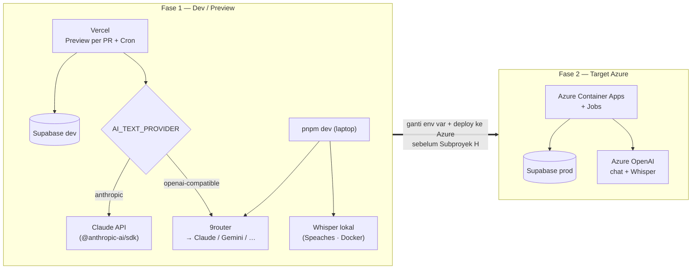
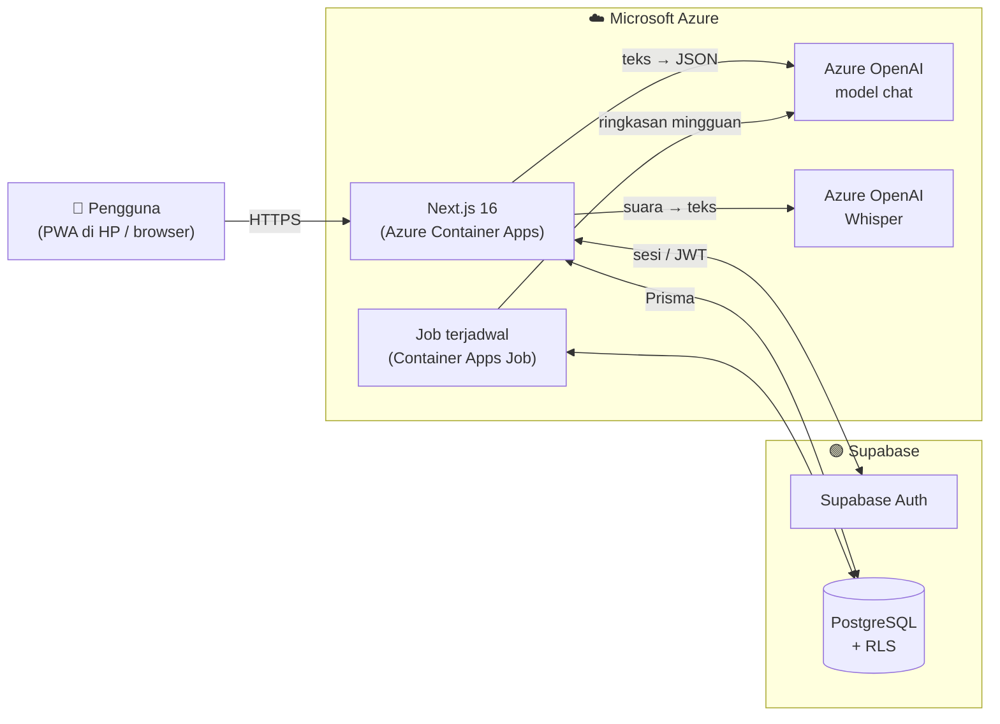
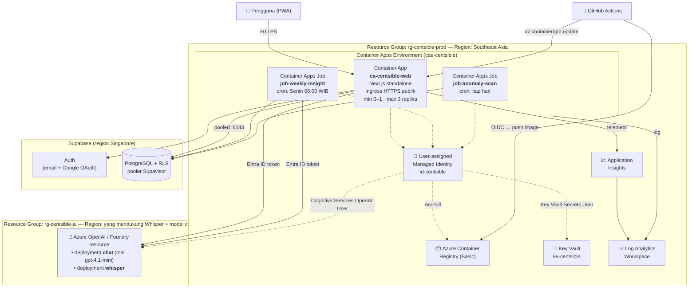
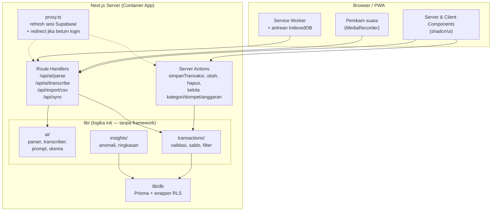
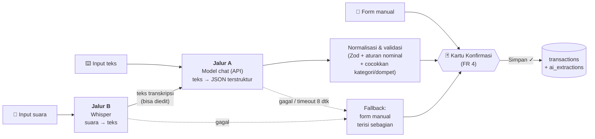
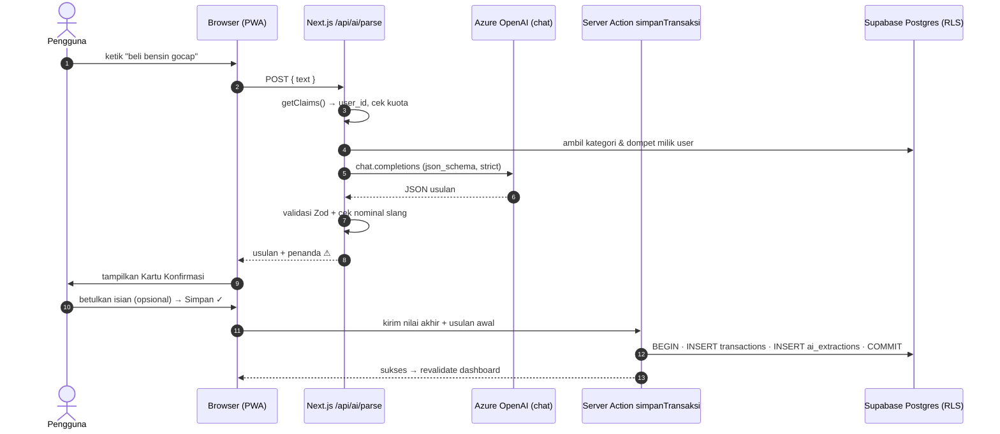
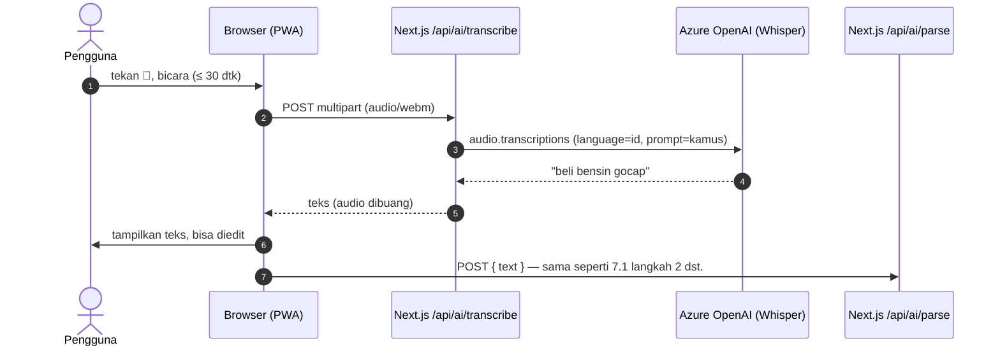
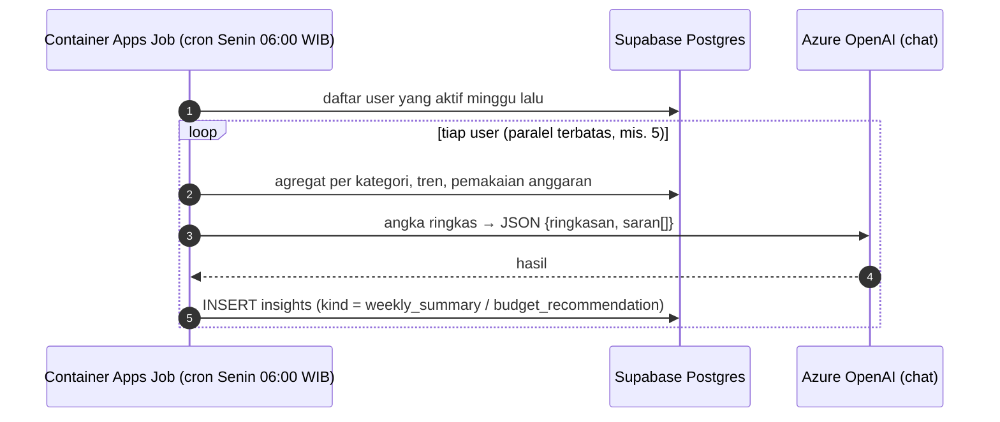
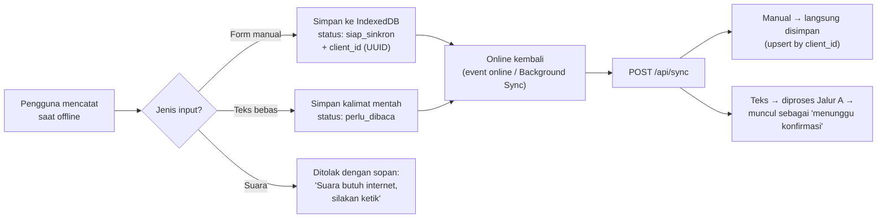
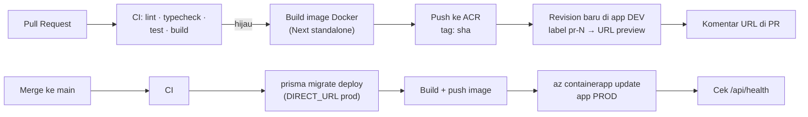

# Arsitektur Sistem — Centsible

**Nama Proyek:** Centsible <br>
**Kelompok:** MDG (My Duit Gweh) <br>
**Dokumen ini adalah deliverable Subproyek B — "Merancang arsitektur sistem & memilih teknologi"** (lihat [Breakdown Proyek](breakdown.md)).

Dokumen ini menjelaskan **bagian apa saja yang membentuk Centsible, di mana tiap bagian dijalankan (Azure), dan bagaimana data mengalir** dari saat pengguna mengetik/mengucapkan transaksi sampai transaksi tersimpan dan diolah jadi insight. Setiap keputusan dikaitkan ke Functional Requirement (FR 1–FR 17) di [halaman utama](index.md#d-functional-requirements), supaya jelas **kenapa** bagian itu ada.

---

## Daftar Isi

0. [Disclaimer — Fase Awal Pengembangan](#0-disclaimer--fase-awal-pengembangan)
1. [Ringkasan Arsitektur](#1-ringkasan-arsitektur)
2. [Prinsip Arsitektur](#2-prinsip-arsitektur)
3. [Teknologi yang Dipakai](#3-teknologi-yang-dipakai)
4. [Arsitektur Cloud di Azure](#4-arsitektur-cloud-di-azure)
5. [Arsitektur Aplikasi (di dalam Next.js)](#5-arsitektur-aplikasi-di-dalam-nextjs)
6. [Arsitektur AI — Main Path](#6-arsitektur-ai--main-path)
7. [Alur Data per Fitur](#7-alur-data-per-fitur)
8. [Keamanan & Isolasi Data](#8-keamanan--isolasi-data)
9. [Lingkungan, CI/CD & Rilis](#9-lingkungan-cicd--rilis)
10. [Pemantauan & Pengukuran Akurasi AI](#10-pemantauan--pengukuran-akurasi-ai)
11. [Pemetaan FR → Komponen](#11-pemetaan-fr--komponen)
12. [Kebutuhan Non-Fungsional & Cara Arsitektur Memenuhinya](#12-kebutuhan-non-fungsional--cara-arsitektur-memenuhinya)
13. [Estimasi Biaya & Batasan](#13-estimasi-biaya--batasan)
14. [Keputusan Arsitektur (ADR Singkat)](#14-keputusan-arsitektur-adr-singkat)
15. [Referensi Dokumentasi](#15-referensi-dokumentasi)

---

## 0. Disclaimer — Fase Awal Pengembangan

> ⚠️ **Arsitektur Azure di dokumen ini adalah _target_ (produksi), bukan kondisi di awal pengerjaan.** Supaya tim bisa bergerak cepat tanpa langsung menyiapkan seluruh resource Azure, fase awal (development & preview) memakai susunan yang lebih ringan. Bagian lain dokumen ini tetap berlaku; yang berbeda hanya **tempat aplikasi di-deploy** dan **penyedia AI**.

| Komponen | **Fase 1 — Development / Preview** (sekarang) | **Fase 2 — Target** (§4–§14) |
|---|---|---|
| Hosting web + preview per PR | **Vercel** (Preview Deployment otomatis per PR/branch) — sesuai Breakdown D | Azure Container Apps (revision `pr-N`) |
| Tugas terjadwal (FR 13–14) | **Vercel Cron** → Route Handler `/api/cron/*` yang dilindungi `CRON_SECRET` | Container Apps Jobs |
| AI teks → JSON (Jalur A) | **API di luar Azure**: Claude API langsung, **atau** lewat **9router** (gateway OpenAI-compatible) | Azure OpenAI (model chat) |
| AI suara → teks (Jalur B) | **Whisper lokal** (mis. [Speaches](https://github.com/speaches-ai/speaches) / faster-whisper di Docker, endpoint OpenAI-compatible `/v1/audio/transcriptions`) | Azure OpenAI Whisper |
| Rahasia | Environment Variables di dashboard Vercel (Development / Preview / Production) | Key Vault + Managed Identity |
| Observabilitas | Log bawaan Vercel + tabel `ai_extractions` | Application Insights |
| Auth & DB | **Supabase — sama** | Supabase — sama |

### 0.1 Kenapa aman untuk pindah nanti

Semua pemanggilan AI sudah dibungkus di `lib/ai/` (P3, ADR-04). Route Handler `/api/ai/parse` dan `/api/ai/transcribe` **tidak tahu** penyedianya; yang dipilih lewat env var:

```ts
// lib/ai/index.ts — satu-satunya tempat yang tahu penyedia AI
export interface TextParser {
  parse(input: string, ctx: UserAiContext): Promise<ParsedTransaction>; // hasil sudah lolos Zod
}
export interface Transcriber {
  transcribe(file: File): Promise<string>;
}

export const textParser: TextParser =
  process.env.AI_TEXT_PROVIDER === "anthropic" ? anthropicParser()             // Claude API (SDK resmi)
  : process.env.AI_TEXT_PROVIDER === "openai-compatible" ? openAiCompatParser() // 9router, dsb.
  : azureParser();                                                              // target produksi

// Whisper lokal, Azure Whisper, dan server lain yang OpenAI-compatible
// cukup dibedakan baseURL + model — pemanggilannya sama (audio.transcriptions.create).
export const transcriber: Transcriber = openAiCompatTranscriber({
  baseURL: process.env.AI_STT_BASE_URL!, // mis. http://localhost:8000/v1
  model: process.env.AI_STT_MODEL!,      // mis. Systran/faster-whisper-small
});
```

Migrasi ke Azure = ganti env var + buat resource, **bukan** menulis ulang fitur.

### 0.2 Hal yang perlu diperhatikan di Fase 1

1. **Claude API: pakai SDK resmi `@anthropic-ai/sdk`, bukan endpoint kompatibilitas OpenAI.** Lapisan kompatibilitas OpenAI milik Anthropic **mengabaikan `response_format`** dan `strict`, sehingga jaminan skema (ADR-06) hilang. Dengan SDK resmi, skema tetap dijamin lewat *Structured Outputs*: `client.messages.parse({ model, output_config: { format: zodOutputFormat(schema) }, ... })`. Skema Zod dibangun per pengguna (`z.enum(kategoriPengguna)`), jadi aturan "model tidak bisa mengarang kategori" tetap berlaku. Model diisi lewat `AI_TEXT_MODEL` (mis. `claude-opus-5`); model yang lebih murah seperti `claude-haiku-4-5` boleh dicoba asalkan lolos target akurasi di dataset evaluasi (§10.2).
2. **9router tidak menjamin Structured Outputs.** 9router meneruskan request ke penyedia yang berbeda-beda (Claude, Gemini, GLM, …) dengan *fallback* otomatis; apakah `response_format: json_schema` dihormati tergantung penyedia yang akhirnya melayani. Karena itu jalur `openai-compatible` **wajib** memvalidasi hasil dengan Zod dan mencoba ulang satu kali sebelum fallback ke form manual (§6.4). Catat juga model yang benar-benar menjawab di `ai_extractions`, karena akurasi bisa berbeda antar penyedia.
3. **Vercel tidak bisa menjangkau `localhost`.** Whisper lokal (`localhost:8000`) dan 9router (default `localhost:20128/v1`) hanya bisa dipakai dari `pnpm dev` di laptop yang sama. Untuk **Preview Deployment** di Vercel pilih salah satu:
   - jalankan 9router / Whisper di VPS atau lewat *tunnel* (mis. Cloudflare Tunnel) **dengan API key** — jangan membuka endpoint tanpa autentikasi ke internet; atau
   - matikan fitur suara di preview dengan `AI_STT_ENABLED=false` (tombol mikrofon disembunyikan, input teks tetap jalan — sesuai prinsip fallback FR 7).
4. **Region Vercel Functions** diset dekat Supabase (Singapura, `sin1`) di pengaturan project, supaya tiap query tidak bolak-balik ke region default di AS.
5. **Batas Vercel Functions:** body request/response maksimal **4,5 MB** — aman untuk rekaman 30 detik (§6.2). Durasi maksimum fungsi & frekuensi Cron tergantung paket Vercel; cek sebelum menjadwalkan FR 13–14.
6. **Privasi & ketentuan layanan.** Di Fase 1 kalimat transaksi dikirim ke penyedia di luar Azure (Anthropic, atau penyedia mana pun yang dipilih 9router). Gunakan **data uji / data tim**, bukan data responden. Pastikan akun upstream yang disambungkan ke 9router memang mengizinkan pemakaian lewat API untuk aplikasi — 9router adalah gateway pribadi tanpa SLA, sehingga **tidak dipakai untuk uji coba pengguna (Subproyek H)**.
7. **Whisper lokal ≠ Azure Whisper persis.** Ukuran model (`small`, `medium`, `large-v3`) dan runtime (faster-whisper/CTranslate2) memengaruhi akurasi. `language: "id"` dan `prompt` kamus slang tetap dikirim, tetapi angka akurasi Fase 1 **harus diukur ulang** setelah pindah ke Azure.

### 0.3 Kapan pindah ke Fase 2

Pindah ke arsitektur Azure (§4) **sebelum uji coba 14 hari dengan pengguna nyata (Subproyek H)**. Pada titik itu dibutuhkan: data pengguna nyata di cloud yang terkendali, penyedia AI dengan SLA, dan Whisper yang bisa dijangkau dari aplikasi yang ter-deploy.



---

## 1. Ringkasan Arsitektur

Centsible adalah **satu aplikasi Next.js (App Router)** yang dibungkus jadi container dan dijalankan di **Azure Container Apps**. Aplikasi ini berbicara dengan tiga layanan luar:

| Layanan | Tugas | Kenapa layanan ini |
|---|---|---|
| **Supabase** (Auth + PostgreSQL) | Login, penyimpanan seluruh data, penguncian data antar-pengguna (RLS) | Sudah ditetapkan di Breakdown (D, E). Auth + Postgres + Row Level Security jadi satu paket, jadi FR 1 dan FR 17 tidak perlu dibangun sendiri |
| **Azure OpenAI — model chat (API)** | **Jalur teks → teks**: membaca kalimat transaksi jadi JSON terstruktur, menulis ringkasan mingguan | Mendukung *Structured Outputs* (`json_schema` + `strict`), jadi keluaran AI selalu sesuai skema |
| **Azure OpenAI — Whisper** | **Jalur suara → teks**: mengubah rekaman suara jadi teks | Satu resource dan satu cara login dengan model chat; hasil teksnya langsung masuk ke jalur teks → teks |

> **Satu kalimat:** semua input (teks, suara, manual) diubah jadi **satu bentuk data yang sama**, lalu **selalu** melewati kartu konfirmasi sebelum disimpan ke Supabase.



---

## 2. Prinsip Arsitektur

Prinsip ini diturunkan langsung dari rumusan masalah dan FR. Setiap keputusan teknis di bawah harus bisa dirujuk balik ke salah satu prinsip ini.

| # | Prinsip | Asal | Dampak ke arsitektur |
|---|---|---|---|
| P1 | **AI tidak pernah menyimpan sendiri** | FR 4 | Endpoint AI **hanya mengembalikan usulan**, tidak menulis ke tabel `transactions`. Penyimpanan hanya lewat satu aksi `simpanTransaksi` yang dipicu tombol Simpan |
| P2 | **Aplikasi tetap bisa dipakai walaupun AI mati** | FR 7 | Form manual tidak bergantung pada Azure OpenAI sama sekali. Kalau AI gagal atau lewat batas waktu, pengguna langsung dialihkan ke form yang sudah terisi sebagian |
| P3 | **Satu jalur konfirmasi untuk semua input** | FR 4, FR 6 | Suara → teks → jalur yang sama dengan input teks. Tidak ada logika khusus suara setelah transkripsi |
| P4 | **Penguncian data di tingkat basis data** | FR 17 | RLS di Supabase aktif untuk semua tabel pengguna, **termasuk** saat diakses lewat Prisma (lihat [§8](#8-keamanan--isolasi-data)) |
| P5 | **Uang = bilangan bulat, saldo = hasil hitung** | ERD | Tidak ada kolom saldo. AI juga wajib mengembalikan nominal sebagai `integer` rupiah |
| P6 | **Tanpa kunci rahasia yang ditanam di kode** | Keamanan | Aplikasi masuk ke Azure OpenAI lewat *Managed Identity*; rahasia lain disimpan di Key Vault |
| P7 | **Murah saat sepi** | Anggaran mahasiswa | Container bisa turun ke 0 replika di lingkungan uji coba; AI dibayar per token/per menit audio |

---

## 3. Teknologi yang Dipakai

| Lapisan | Teknologi | Versi / catatan |
|---|---|---|
| Framework web | **Next.js (App Router)** + React | Next 16 (sudah di-*scaffold*), `output: 'standalone'` untuk container |
| Bahasa | TypeScript | Mode `strict` |
| UI | Tailwind CSS v4 + shadcn/ui | Sesuai Subproyek C |
| Validasi | Zod | Satu skema dipakai di form manual, di keluaran AI, dan di Server Action |
| ORM | **Prisma 7** + `@prisma/adapter-pg` | URL koneksi diatur di `prisma.config.ts` (bukan lagi di `schema.prisma`) |
| Auth & DB | **Supabase** (`@supabase/ssr`) | Pakai `getClaims()` untuk verifikasi sesi; kunci *publishable* di klien |
| AI (teks) | **Azure OpenAI** — deployment model chat (mis. `gpt-4.1-mini`) | Dipanggil lewat SDK `openai` ke endpoint `/openai/v1/` |
| AI (suara) | **Azure OpenAI — Whisper** | Endpoint `/openai/v1/audio/transcriptions`, batas file 25 MB |
| Offline | Service Worker + IndexedDB | FR 16 |
| Hosting | **Azure Container Apps** | + Container Apps Job untuk tugas terjadwal |
| Registry | Azure Container Registry | Menyimpan image hasil build CI |
| Rahasia | Azure Key Vault | Dirujuk langsung dari Container Apps |
| Observabilitas | Application Insights + Log Analytics | Via OpenTelemetry (`@azure/monitor-opentelemetry`) |
| CI/CD | GitHub Actions | Login ke Azure dengan OIDC (tanpa password tersimpan) |

> **Catatan perubahan terhadap Breakdown:** Breakdown D menyebut rilis ke **Vercel** — ini tetap dipakai di **Fase 1 (development/preview)**, lihat [§0](#0-disclaimer--fase-awal-pengembangan). Untuk **target produksi**, hosting dipindah ke **Azure Container Apps** agar seluruh arsitektur cloud (aplikasi + AI) berada di Azure dan bisa memakai kredit *Azure for Students*. Fitur "link uji coba per PR" tetap ada di kedua fase (Vercel Preview Deployment → *revision* per PR di Azure, lihat [§9](#9-lingkungan-cicd--rilis)).
>
> Tabel di atas adalah **kondisi target**. Di Fase 1, baris *AI (teks)* diganti Claude API / 9router, baris *AI (suara)* diganti Whisper lokal, dan baris *Hosting / Registry / Rahasia / Observabilitas* diganti Vercel.

---

## 4. Arsitektur Cloud di Azure

### 4.1 Diagram Resource

Semua resource Azure berada dalam **satu Resource Group** per lingkungan (`rg-centsible-prod`, `rg-centsible-dev`) supaya mudah dipantau biayanya dan mudah dihapus.



### 4.2 Penjelasan Tiap Resource

| Resource | Fungsi | Setelan penting | FR terkait |
|---|---|---|---|
| **Container Apps Environment** | "Wadah" jaringan & log bersama untuk app dan job | Tipe *Consumption*; log dikirim ke Log Analytics | — |
| **Container App `ca-centsible-web`** | Menjalankan Next.js: halaman, Server Action, Route Handler AI | Ingress HTTPS eksternal, port 3000. **Prod: `minReplicas=1`** (hindari *cold start* saat pengguna mencatat di kasir). **Dev/preview: `minReplicas=0`** (hemat). Skala HTTP `maxReplicas=3` | Semua |
| **Container Apps Job `job-weekly-insight`** | Membuat ringkasan mingguan + saran anggaran untuk tiap pengguna aktif | `triggerType=Schedule`, cron dalam **UTC** (`0 23 * * 0` = Senin 06:00 WIB), `replicaTimeout` 1800 dtk, retry 1 | FR 13 |
| **Container Apps Job `job-anomaly-scan`** | Menghitung pengeluaran tidak wajar per pengguna | Cron harian; image yang sama dengan web app, beda perintah (`node scripts/anomaly.js`) | FR 14 |
| **Managed Identity `id-centsible`** | Identitas aplikasi untuk login ke ACR, Key Vault, Azure OpenAI **tanpa password** | *User-assigned* supaya satu identitas dipakai app + job, dan izinnya bisa diberikan sebelum app dibuat | P6 |
| **Azure Container Registry** | Menyimpan image Docker hasil CI | SKU Basic; *admin user* dimatikan, tarik image pakai `AcrPull` | — |
| **Key Vault** | Menyimpan `DATABASE_URL`, `SUPABASE_SECRET_KEY`, `CRON_SECRET` | Container App merujuk rahasia dengan `keyvaultref:` sehingga nilai tidak pernah ditulis di pipeline | P6 |
| **Azure OpenAI / Foundry resource** | Tempat dua deployment model: **chat** dan **whisper** | Login via Entra ID (`Cognitive Services OpenAI User`); kunci API boleh dinonaktifkan. Region **harus dicek** di tabel ketersediaan model karena Whisper hanya tersedia sebagai deployment *Standard/regional* | FR 2, 3, 6, 13 |
| **Log Analytics + Application Insights** | Log, trace, metrik latensi AI & error | Retensi 30 hari (cukup untuk proyek semester) | NFR |

### 4.3 Pemilihan Region

| Komponen | Region | Alasan |
|---|---|---|
| Container Apps + Supabase | **Southeast Asia (Singapore)** + Supabase **ap-southeast-1 (Singapore)** | Aplikasi ↔ DB adalah jalur paling "cerewet" (banyak query per halaman). Menaruh keduanya di kota yang sama membuat latensi query di bawah beberapa ms. Pengguna di Indonesia ke Singapore juga dekat |
| Azure OpenAI | Region yang **menyediakan Whisper dan model chat pilihan sekaligus** | Whisper tidak tersedia di semua region. Panggilan AI hanya ±1–2 kali per transaksi dan sudah berdurasi ratusan ms–detik, jadi tambahan latensi lintas region relatif kecil. **Sebelum membuat resource, cek tabel *Model availability by region* di Microsoft Learn** — jangan asumsikan |

> **Kenapa bukan Azure Database for PostgreSQL?** Bisa, tapi kita akan kehilangan Supabase Auth + RLS yang terintegrasi dengan JWT, lalu harus membangun sendiri FR 1 dan FR 17. Supabase tetap dipakai sebagai layanan data; Azure dipakai untuk komputasi dan AI.

---

## 5. Arsitektur Aplikasi (di dalam Next.js)

### 5.1 Lapisan Aplikasi



**Kapan pakai Server Action, kapan Route Handler?**

| Pakai | Untuk | Alasan |
|---|---|---|
| **Server Action** | Menyimpan/mengubah/menghapus data dari form (termasuk tombol **Simpan** di kartu konfirmasi) | Terintegrasi dengan form & `revalidatePath`, validasi Zod di server |
| **Route Handler** | Panggilan AI, upload audio, unduh CSV, sinkronisasi offline | (1) Upload audio bisa melebihi batas bawaan body Server Action (1 MB). (2) Service Worker perlu URL tetap untuk sinkronisasi. (3) CSV dikirim sebagai *stream* dengan header `Content-Disposition` |

### 5.2 Struktur Folder

```text
app/
├── (auth)/login, register, reset-password/
├── (app)/
│   ├── page.tsx                 # Dashboard (FR 12)
│   ├── transaksi/               # Daftar + filter (FR 8)
│   ├── laporan/                 # Tren + anggaran (FR 11, 12)
│   └── pengaturan/              # Kategori, dompet, akun (FR 1, 9, 10)
├── api/
│   ├── ai/parse/route.ts        # Jalur teks → JSON (FR 2, 3)
│   ├── ai/transcribe/route.ts   # Jalur suara → teks (FR 6)
│   ├── export/csv/route.ts      # FR 15
│   └── sync/route.ts            # Sinkronisasi antrean offline (FR 16)
├── manifest.ts                  # PWA manifest (FR 16)
proxy.ts                         # Next 16: pengganti middleware.ts
lib/
├── ai/          # client Azure OpenAI, prompt, skema JSON, normalisasi nominal
├── db/          # Prisma client + withRls()
├── supabase/    # client.ts, server.ts, proxy.ts (pola resmi @supabase/ssr)
├── transactions/
└── insights/
prisma/
├── schema.prisma
└── migrations/  # termasuk SQL kebijakan RLS
prisma.config.ts
scripts/         # entry point Container Apps Job (weekly-insight, anomaly)
```

---

## 6. Arsitektur AI — Main Path

Bagian ini adalah inti Centsible. AI punya **dua jalur utama** yang bertemu di satu titik:

| Jalur | Input | Layanan | Output |
|---|---|---|---|
| **Jalur A — Teks → Teks (API)** | Kalimat bebas, mis. *"beli bensin gocap kemarin pake gopay"* | **Azure OpenAI Chat Completions** + *Structured Outputs* | JSON transaksi usulan |
| **Jalur B — Suara → Teks (Whisper)** | Rekaman suara (webm/mp4, ≤ 30 detik) | **Azure OpenAI Whisper** (`/audio/transcriptions`) | Teks transkripsi → **diteruskan ke Jalur A** |



### 6.1 Jalur A — Teks → Teks (Model Chat via API)

**Tujuan:** mengubah kalimat bebas jadi 6 isian: nominal, jenis, kategori, dompet, keterangan, tanggal (FR 3).

**Langkah di server (`/api/ai/parse`):**

1. **Verifikasi sesi** dengan `supabase.auth.getClaims()` → dapat `user_id`.
2. **Cek kuota** pengguna (mis. 100 panggilan AI/hari) supaya biaya tidak jebol.
3. **Ambil konteks pengguna:** daftar kategori & dompet aktif miliknya, serta zona waktu.
4. **Bangun skema JSON dinamis** — isian `category` dan `wallet` dibatasi dengan `enum` berisi nama kategori/dompet milik pengguna itu. Dengan mode `strict: true`, model **tidak mungkin** mengarang kategori yang tidak ada.
5. **Panggil model chat** dengan *Structured Outputs* (`response_format.type = "json_schema"`, `strict: true`), `temperature` rendah, dan batas waktu 8 detik.
6. **Normalisasi & validasi** hasilnya (lihat 6.3).
7. **Kembalikan usulan** ke klien → tampil di kartu konfirmasi. **Tidak ada yang ditulis ke `transactions` di langkah ini** (P1).

**Konfigurasi client (keyless, sesuai docs Microsoft Learn terbaru):**

```ts
// lib/ai/client.ts
import OpenAI from "openai";
import { DefaultAzureCredential, getBearerTokenProvider } from "@azure/identity";

const tokenProvider = getBearerTokenProvider(
  new DefaultAzureCredential(), // lokal: az login · Azure: Managed Identity
  "https://ai.azure.com/.default",
);

export const aoai = new OpenAI({
  baseURL: `${process.env.AZURE_OPENAI_ENDPOINT}/openai/v1/`,
  apiKey: tokenProvider,
});
```

> Endpoint `/openai/v1/` membuat Azure OpenAI bisa dipakai dengan SDK `openai` biasa — tidak perlu `api-version` di setiap panggilan. Parameter `model` diisi **nama deployment**, bukan nama model (mis. `process.env.AZURE_OPENAI_CHAT_DEPLOYMENT`).

**Skema keluaran (contoh, dibangun per pengguna):**

```ts
// lib/ai/schema.ts
export function transactionSchema(categories: string[], wallets: string[]) {
  return {
    type: "object",
    properties: {
      amount:      { type: "integer", description: "Nominal dalam rupiah, bilangan bulat" },
      type:        { type: "string", enum: ["income", "expense"] },
      category:    { type: "string", enum: categories },
      wallet:      { type: ["string", "null"], enum: [...wallets, null] },
      description: { type: "string" },
      occurred_at: { type: "string", description: "Tanggal ISO YYYY-MM-DD" },
      confidence:  { type: "number" },
    },
    required: ["amount", "type", "category", "wallet", "description", "occurred_at", "confidence"],
    additionalProperties: false,
  } as const;
}
```

**Isi prompt sistem (garis besar):**

- Peran: pembaca transaksi keuangan mahasiswa Indonesia.
- **Tanggal hari ini + zona waktu pengguna** disisipkan di prompt, supaya *"kemarin"*, *"tadi pagi"*, *"Senin lalu"* bisa diubah jadi tanggal pasti.
- **Kamus nominal slang**: gopek = 500, seceng = 1.000, goceng = 5.000, ceban = 10.000, gocap = 50.000, cepek = 100 (dalam percakapan sering berarti 100.000 — ambiguitas seperti ini ditandai ⚠ di kartu konfirmasi), `rb`/`k` = ×1.000, `jt` = ×1.000.000. Daftar final diambil dari hasil wawancara (Subproyek A) dan diuji di dataset evaluasi.
- 5–10 contoh *few-shot* dari data uji.
- Aturan: kalau dompet tidak disebut → `null` (nanti dipakai dompet default pengguna).

### 6.2 Jalur B — Suara → Teks (Whisper)

**Tujuan:** FR 6 — rekam, ubah jadi teks, lalu **diproses sama persis** seperti input teks.

**Alur:**

1. Browser merekam dengan `MediaRecorder` (Chrome/Android → `audio/webm;codecs=opus`, Safari/iOS → `audio/mp4`). Keduanya format yang didukung Whisper.
2. Rekaman **dibatasi 30 detik** di sisi klien. Satu kalimat transaksi biasanya < 10 detik, dan 30 detik opus hanya puluhan–ratusan KB — jauh di bawah batas Whisper **25 MB**.
3. Upload `multipart/form-data` ke **Route Handler** `/api/ai/transcribe` (bukan Server Action, karena batas body).
4. Server memanggil Whisper:

   ```ts
   const text = await aoai.audio.transcriptions.create({
     file,                                        // File dari formData
     model: process.env.AZURE_OPENAI_WHISPER_DEPLOYMENT!,
     language: "id",                              // paksa Bahasa Indonesia
     prompt: "gocap, ceban, goceng, seceng, gopay, ovo, dana, kos, bensin",
     response_format: "text",
   });
   ```

   Parameter `prompt` dipakai sebagai **kamus kosakata** agar Whisper mengeja slang & merek e-wallet dengan benar, bukan jadi kata yang mirip bunyinya.
5. Teks transkripsi **ditampilkan dulu dan bisa diedit** oleh pengguna, lalu dikirim ke **Jalur A** (`/api/ai/parse`). Setelah titik ini tidak ada logika khusus suara (P3).
6. **File audio tidak disimpan** di mana pun — hanya ada di memori selama request. Ini mengurangi risiko privasi dan menghilangkan kebutuhan Blob Storage.

> **Kenapa tidak langsung "audio → JSON" dengan satu model?** Karena memisahkan transkripsi dan ekstraksi membuat (1) pengguna bisa melihat & membetulkan teks sebelum diproses, (2) jalur ekstraksi cukup dievaluasi satu kali untuk dua jenis input, dan (3) kita bisa mengukur akurasi Whisper dan akurasi parser **secara terpisah** — kalau hasilnya salah, jelas bagian mana yang salah.

### 6.3 Normalisasi & Validasi Setelah AI

Keluaran AI **tidak langsung dipercaya**. Setelah Jalur A, server menjalankan:

| Pemeriksaan | Kenapa |
|---|---|
| Validasi Zod (skema yang sama dengan form manual) | Satu sumber kebenaran untuk bentuk data transaksi |
| `amount > 0` dan `amount ≤ batas wajar` (mis. 100 juta) | Menangkap salah baca seperti "50" padahal "50rb" |
| Cek silang nominal dengan **parser slang deterministik** (regex + kamus) | Kalau hasil regex dan AI berbeda, isian nominal ditandai ⚠ di kartu konfirmasi agar pengguna memeriksa |
| `occurred_at` tidak di masa depan & tidak lebih dari 1 tahun lalu | Menangkap salah tafsir tanggal relatif |
| `wallet = null` → isi dompet default pengguna | Pengguna tidak dipaksa menyebut dompet |
| `confidence < 0,6` → isian terkait ditandai ⚠ | Memberi sinyal visual di kartu konfirmasi |

### 6.4 Penanganan Gagal (Fallback)

| Kondisi | Yang terjadi |
|---|---|
| Azure OpenAI error / timeout > 8 dtk | Form manual terbuka dengan **keterangan terisi kalimat asli**; pengguna tinggal isi nominal & kategori (FR 7) |
| Kena *rate limit* (HTTP 429) | Satu kali coba ulang dengan jeda, lalu fallback ke form manual |
| Kuota harian pengguna habis | Pesan jelas + form manual |
| Whisper gagal / audio kosong | Pesan "suara tidak terdengar jelas", tombol rekam ulang + opsi ketik |
| Offline | Suara **tidak bisa** diproses. Input teks disimpan ke antrean IndexedDB sebagai **kalimat mentah**, diproses saat online, dan **tetap** harus dikonfirmasi pengguna (lihat §7.4) |

### 6.5 Catatan Kerja AI (`ai_extractions`) — FR 5

Setiap kali pengguna menekan **Simpan** pada transaksi yang berasal dari AI, Server Action `simpanTransaksi` menulis **dalam satu transaksi database**:

1. Baris baru di `transactions`.
2. Baris baru di `ai_extractions` berisi `raw_input`, `input_mode` (text/voice), `parsed_result` (usulan AI), `user_corrections` (hanya isian yang diubah pengguna — diff antara usulan dan nilai akhir), `model_version` (nama deployment + versi prompt), `latency_ms`.

Data inilah yang dipakai untuk mengukur target **≥ 85% tanpa koreksi pada nominal & kategori** (lihat §10).

### 6.6 AI untuk Insight (FR 13 & FR 14)

| Fitur | Siapa yang menghitung | Peran model chat |
|---|---|---|
| **Deteksi pengeluaran tidak wajar (FR 14)** | **SQL/statistik**, bukan AI: per pengguna per kategori, bandingkan dengan median 8 minggu terakhir memakai *median absolute deviation* (MAD). Tahan terhadap satu-dua transaksi besar, dan batasnya otomatis mengikuti kebiasaan tiap pengguna | Tidak dipakai (atau opsional: hanya merangkai kalimat peringatan) |
| **Ringkasan mingguan + saran anggaran (FR 13)** | Job menghitung **angka-angkanya dulu** di SQL (total per kategori, perubahan vs rata-rata 4 minggu, pemakaian anggaran) | Menerima angka ringkas tersebut (bukan daftar transaksi mentah) lalu menulis ringkasan + ≥ 1 saran dalam format JSON terstruktur |

> **Kenapa anomali tidak diserahkan ke LLM?** LLM tidak konsisten dalam berhitung dan hasilnya sulit diuji. Deteksi berbasis statistik bisa dites unit, murah, dan bisa dijelaskan ke pengguna ("3× lebih besar dari biasanya"). LLM dipakai di bagian yang memang kuat: menulis dengan bahasa yang mudah dipahami. Mengirim angka ringkas (bukan transaksi mentah) juga menghemat token dan mengurangi data pribadi yang dikirim ke layanan AI.

---

## 7. Alur Data per Fitur

### 7.1 Mencatat Lewat Teks (FR 2, 3, 4, 5)



### 7.2 Mencatat Lewat Suara (FR 6)



### 7.3 Ringkasan Mingguan (FR 13)



Job dibuat **idempoten**: sebelum menulis, cek apakah insight untuk `(user_id, minggu)` sudah ada, sehingga retry tidak membuat duplikat.

### 7.4 Offline & Sinkronisasi (FR 16)



- `client_id` (UUID dibuat di perangkat) dipakai sebagai **kunci idempoten**, jadi sinkron yang terulang tidak membuat transaksi ganda.
- Transaksi dari form manual boleh langsung disimpan karena pengguna sudah "mengonfirmasi" dengan mengisi form. Kalimat bebas **tetap** harus lewat kartu konfirmasi (P1).

### 7.5 Login & Sesi (FR 1)

- Login email/password + Google OAuth ditangani Supabase Auth; callback OAuth ke `/auth/callback`.
- `proxy.ts` (Next 16) memanggil helper `updateSession()` dari `@supabase/ssr`, yang memanggil **`getClaims()`** untuk memvalidasi JWT dan menyegarkan cookie sesi di setiap request, lalu mengalihkan pengguna yang belum login ke `/login`.
- **Hapus akun:** Server Action memakai *secret key* Supabase (hanya di server, dari Key Vault) untuk `auth.admin.deleteUser()`; semua tabel punya `ON DELETE CASCADE` dari `user_id`, jadi seluruh data ikut terhapus.

---

## 8. Keamanan & Isolasi Data

### 8.1 Lapisan Pertahanan

| Lapisan | Mekanisme |
|---|---|
| Transport | HTTPS wajib (ingress Container Apps, sertifikat terkelola untuk domain kustom) |
| Autentikasi | Supabase Auth, JWT diverifikasi via `getClaims()` di `proxy.ts` **dan** diulang di tiap Server Action / Route Handler (jangan hanya mengandalkan proxy) |
| Otorisasi data | **Row Level Security** di semua tabel pengguna: `using (user_id = auth.uid())` (FR 17) |
| Rahasia | Key Vault + Managed Identity; tidak ada kunci di repo, di image, atau di variabel GitHub |
| Akses AI | Entra ID (role `Cognitive Services OpenAI User`), bukan API key |
| Penyalahgunaan AI | Kuota per pengguna per hari, batas panjang input teks (mis. 300 karakter), batas durasi audio 30 dtk |
| Privasi | Audio tidak disimpan; ke LLM insight hanya dikirim **angka agregat**, bukan daftar transaksi |

### 8.2 Jebakan Penting: Prisma vs RLS

Prisma terhubung ke Postgres memakai *connection string* dengan role `postgres`, yang **melewati RLS**. Kalau dibiarkan, FR 17 hanya dijaga oleh `where: { userId }` di kode — satu kali lupa, data pengguna lain bocor.

**Solusi yang dipilih: jalankan query Prisma sebagai role `authenticated` dengan klaim JWT pengguna**, di dalam satu transaksi:

```ts
// lib/db/with-rls.ts
export async function withRls<T>(claims: JwtClaims, fn: (tx: Tx) => Promise<T>) {
  return prisma.$transaction(async (tx) => {
    await tx.$executeRaw`select set_config('request.jwt.claims', ${JSON.stringify(claims)}, true)`;
    await tx.$executeRaw`set local role authenticated`;
    return fn(tx);
  });
}
```

Dengan cara ini, `auth.uid()` di kebijakan RLS bekerja sama seperti saat diakses lewat Supabase client, sehingga **basis data yang menolak** akses lintas pengguna. Klien Prisma tanpa `withRls` hanya dipakai untuk migrasi dan Job terjadwal (yang memang perlu membaca semua pengguna).

| Alternatif | Kenapa tidak dipilih |
|---|---|
| Hanya pakai Supabase JS client (PostgREST) | RLS otomatis, tapi kehilangan tipe & query builder Prisma, dan Breakdown sudah menetapkan Prisma |
| Prisma biasa + `where userId` di semua query | Tidak memenuhi FR 17 ("diterapkan langsung di tingkat basis data") |

### 8.3 Koneksi Database

Sesuai Prisma 7 + Supabase:

| Variabel | Dipakai oleh | Isi |
|---|---|---|
| `DATABASE_URL` | Runtime (Prisma Client via `@prisma/adapter-pg`) | URL pooler Supavisor, **mode transaction, port 6543** — cocok untuk banyak replika container |
| `DIRECT_URL` | Prisma CLI (`migrate deploy`) lewat `prisma.config.ts` | URL langsung / session mode, port 5432 — migrasi butuh koneksi non-pooled |

---

## 9. Lingkungan, CI/CD & Rilis

### 9.1 Lingkungan

| Lingkungan | Tempat | Data | AI |
|---|---|---|---|
| **Lokal** | `pnpm dev` di laptop | Supabase CLI lokal (Docker) atau project Supabase dev | **Fase 1:** Claude API / 9router (`localhost:20128/v1`) + Whisper lokal (`localhost:8000/v1`). **Fase 2:** Deployment Azure OpenAI dev via `az login` (DefaultAzureCredential) |
| **Preview (per PR)** | **Fase 1:** Vercel Preview Deployment. **Fase 2:** Revision baru di Container App **dev** dengan *label* `pr-<nomor>` → URL unik | Project Supabase **dev** | **Fase 1:** Claude API / 9router yang ter-*expose* dengan API key; suara opsional (`AI_STT_ENABLED`). **Fase 2:** Deployment dev |
| **Production** | Container App **prod** (Fase 2) | Project Supabase **prod** | Deployment prod |

> Di Fase 1, CI (`main.yml`) tetap menjadi gerbang kualitas; Vercel Git Integration yang membuat Preview Deployment tiap PR dan menaruh URL-nya di PR. Pipeline Azure di bawah ini baru diaktifkan saat masuk Fase 2.

### 9.2 Pipeline

`.github/workflows/main.yml` yang sudah ada tetap menjadi gerbang kualitas (lint, typecheck, test, build). Workflow deploy ditambahkan setelahnya:



- Login GitHub → Azure memakai **OIDC (federated credential)** lewat `azure/login`, jadi tidak ada *client secret* yang disimpan di GitHub.
- Container Apps menyimpan revision lama, sehingga **rollback = alihkan trafik ke revision sebelumnya**.
- Migrasi dijalankan **sebelum** image baru aktif dan harus bersifat *additive* (tambah kolom dulu, hapus belakangan), supaya revision lama tetap jalan selama pergantian.

### 9.3 Dockerfile (garis besar)

Mengikuti contoh resmi `with-docker` Next.js: tahap `deps` → `builder` (`pnpm build` dengan `output: 'standalone'`) → `runner` berbasis `node:22-alpine`, menyalin `.next/standalone` + `.next/static` + `public`, berjalan sebagai user non-root `node`, `CMD ["node", "server.js"]`.

### 9.4 Variabel Lingkungan

| Nama | Publik? | Sumber di Azure |
|---|---|---|
| `NEXT_PUBLIC_SUPABASE_URL` | Ya (build-time) | Build arg CI |
| `NEXT_PUBLIC_SUPABASE_PUBLISHABLE_KEY` | Ya (build-time) | Build arg CI |
| `SUPABASE_SECRET_KEY` | Tidak | Key Vault |
| `DATABASE_URL` / `DIRECT_URL` | Tidak | Key Vault |
| `AZURE_OPENAI_ENDPOINT` | Tidak (bukan rahasia) | Env var Container App |
| `AZURE_OPENAI_CHAT_DEPLOYMENT` | Tidak | Env var |
| `AZURE_OPENAI_WHISPER_DEPLOYMENT` | Tidak | Env var |
| `AZURE_CLIENT_ID` | Tidak | Client ID Managed Identity (agar `DefaultAzureCredential` memilih identitas yang benar) |
| `APPLICATIONINSIGHTS_CONNECTION_STRING` | Tidak | Env var |

**Tambahan untuk Fase 1** (disimpan di Environment Variables Vercel / `.env.local`):

| Nama | Contoh | Keterangan |
|---|---|---|
| `AI_TEXT_PROVIDER` | `anthropic` \| `openai-compatible` \| `azure` | Memilih implementasi `TextParser` di `lib/ai/` |
| `AI_TEXT_MODEL` | `claude-opus-5` | Nama model untuk penyedia terpilih (di 9router: nama model/*combo* yang terdaftar di dashboard-nya) |
| `ANTHROPIC_API_KEY` | — (rahasia) | Hanya jika `AI_TEXT_PROVIDER=anthropic` |
| `AI_TEXT_BASE_URL` / `AI_TEXT_API_KEY` | `http://localhost:20128/v1` / — (rahasia) | Hanya jika `openai-compatible` (9router) |
| `AI_STT_BASE_URL` / `AI_STT_MODEL` | `http://localhost:8000/v1` / `Systran/faster-whisper-small` | Server Whisper lokal (OpenAI-compatible) |
| `AI_STT_ENABLED` | `true` / `false` | Matikan fitur suara di preview bila Whisper tidak bisa dijangkau dari Vercel |
| `CRON_SECRET` | — (rahasia) | Melindungi `/api/cron/*` yang dipanggil Vercel Cron |

> Variabel `NEXT_PUBLIC_*` ditanam saat build, jadi image dev dan prod **berbeda** kalau project Supabase-nya berbeda. Ini konsekuensi yang disengaja; alternatifnya (membaca konfigurasi publik saat runtime) menambah kerumitan yang belum perlu.

---

## 10. Pemantauan & Pengukuran Akurasi AI

### 10.1 Yang Dipantau

| Metrik | Sumber | Target |
|---|---|---|
| Latensi `/api/ai/parse` (p50 / p95) | Application Insights | p95 ≤ 3 dtk |
| Latensi `/api/ai/transcribe` (p95) | Application Insights | p95 ≤ 4 dtk |
| Rasio fallback ke form manual | Event kustom `ai_fallback` | < 5% |
| Error 5xx & 429 Azure OpenAI | Application Insights | Alert jika > 2% dalam 15 menit |
| Status Job mingguan | Log Container Apps Job | Alert jika gagal |
| Pemakaian token / menit audio | Metrik resource Azure OpenAI | Di bawah anggaran bulanan |

### 10.2 Akurasi AI (target ≥ 85%)

Dua cara pengukuran yang saling melengkapi:

1. **Offline — dataset uji** (Subproyek F): ±200 kalimat berlabel dari hasil wawancara + variasi slang. Script `pnpm eval:ai` memanggil Jalur A dan menghitung *exact match* per isian. Dijalankan setiap kali prompt atau deployment model diganti, dan hasilnya dicatat bersama `model_version`.
2. **Online — data produksi**: dari `ai_extractions`, hitung persentase transaksi yang `user_corrections` **tidak** menyentuh `amount` maupun `category`, dikelompokkan per `model_version` dan per `input_mode`. Dari sini terlihat apakah kesalahan berasal dari Whisper (suara) atau dari parser (teks).

---

## 11. Pemetaan FR → Komponen

| FR | Ringkas | Komponen utama | Layanan cloud |
|---|---|---|---|
| FR 1 | Daftar/masuk, reset, hapus akun | `(auth)/*`, `proxy.ts`, Server Action hapus akun | Supabase Auth |
| FR 2 | Input kalimat biasa + slang | Input bar, `/api/ai/parse`, prompt + kamus slang | Azure OpenAI chat |
| FR 3 | Ekstraksi 6 isian + tanggal relatif | Skema JSON strict, normalisasi §6.3 | Azure OpenAI chat |
| FR 4 | Kartu konfirmasi wajib | Komponen `ConfirmCard`, Server Action `simpanTransaksi` | — |
| FR 5 | Simpan koreksi | Tabel `ai_extractions`, diff usulan vs final | Supabase Postgres |
| FR 6 | Input suara | `MediaRecorder`, `/api/ai/transcribe` | **Azure OpenAI Whisper** |
| FR 7 | Form manual selalu jalan | Form manual (tanpa dependensi AI), fallback §6.4 | — |
| FR 8 | CRUD + filter transaksi | `transaksi/`, Server Actions | Supabase Postgres |
| FR 9 | Kategori bawaan + kelola | Trigger/seed saat user baru dibuat, `pengaturan/` | Supabase Postgres |
| FR 10 | Multi-dompet, saldo dihitung | View/query `initial_balance + Σ transaksi` | Supabase Postgres |
| FR 11 | Anggaran per kategori | `laporan/`, tabel `budgets` | Supabase Postgres |
| FR 12 | Dashboard ringkasan | Server Component + query agregat | Supabase Postgres |
| FR 13 | Ringkasan mingguan AI | `job-weekly-insight`, tabel `insights` | **Container Apps Job** + Azure OpenAI chat |
| FR 14 | Deteksi anomali | `job-anomaly-scan` (median + MAD) | **Container Apps Job** |
| FR 15 | Ekspor CSV | `/api/export/csv` (stream) | — |
| FR 16 | PWA + offline | `manifest.ts`, Service Worker, IndexedDB, `/api/sync` | — |
| FR 17 | Isolasi data | RLS + `withRls()` | Supabase Postgres |

---

## 12. Kebutuhan Non-Fungsional & Cara Arsitektur Memenuhinya

| Kebutuhan | Target (dari Tujuan Produk) | Cara dicapai |
|---|---|---|
| **Kecepatan mencatat** | ≤ 10 dtk dari mengetik sampai tersimpan | Model chat kelas *mini*, `minReplicas=1` di prod (tanpa *cold start*), app & DB satu region, skema strict (tanpa retry karena JSON rusak) |
| **Akurasi AI** | ≥ 85% nominal & kategori tanpa koreksi | Enum kategori per pengguna, kamus slang, cek silang nominal deterministik, evaluasi offline + online (§10) |
| **Ketersediaan** | Aplikasi tetap bisa mencatat saat AI mati | Form manual independen + fallback otomatis; offline queue |
| **Keamanan data** | Tidak ada kebocoran antar-pengguna | RLS di DB + `withRls()`, Managed Identity, Key Vault |
| **Biaya** | Muat di kredit Azure for Students | Scale-to-zero di dev, Job hanya jalan saat jadwal, kuota AI per pengguna, insight pakai angka agregat |
| **Kemudahan dirawat** | Tim 3 orang, waktu terbatas | Satu codebase, satu image untuk web + job, logika inti di `lib/` terpisah dari framework sehingga mudah dites |

---

## 13. Estimasi Biaya & Batasan

Harga pasti **harus dihitung ulang dengan Azure Pricing Calculator** saat resource dibuat, karena harga berbeda per region dan berubah dari waktu ke waktu. Gambaran komponen biayanya:

| Komponen | Pola biaya | Cara menekan |
|---|---|---|
| Container Apps (web) | Per vCPU-detik & GiB-detik; ada kuota gratis bulanan per subscription | Dev/preview `minReplicas=0`; prod 0,5 vCPU / 1 GiB cukup untuk uji coba 10–25 pengguna |
| Container Apps Jobs | Hanya saat berjalan | Jadwal mingguan/harian, beberapa menit per run |
| Azure OpenAI chat | Per token input/output | Model *mini*, prompt ringkas, insight pakai angka agregat |
| Azure OpenAI Whisper | Per durasi audio | Batas 30 dtk per rekaman |
| ACR Basic, Key Vault, Log Analytics | Kecil / per pemakaian | Retensi log 30 hari |
| Supabase | Paket Free cukup untuk fase uji coba | Pantau ukuran DB & MAU |

**Batasan yang diketahui:**

- Whisper hanya tersedia di sebagian region Azure → resource AI mungkin berada di region berbeda dari app.
- Suara tidak bisa dipakai saat offline.
- Paket Free Supabase dapat menjeda project yang tidak aktif — perlu dipantau selama masa uji coba 14 hari.
- Model yang tersedia di Azure OpenAI berganti dari waktu ke waktu; nama deployment dibuat lewat variabel lingkungan supaya pergantian model tidak perlu mengubah kode.

---

## 14. Keputusan Arsitektur (ADR Singkat)

| # | Keputusan | Alternatif yang ditimbang | Alasan |
|---|---|---|---|
| ADR-01 | Hosting di **Azure Container Apps** | Azure App Service, Azure Static Web Apps, Vercel | Container Apps: bisa scale-to-zero, punya **Jobs** terjadwal bawaan untuk FR 13–14 (tanpa layanan cron terpisah), revision + label untuk preview per PR. Static Web Apps kurang cocok untuk Next.js dengan Server Actions & Route Handler berat. App Service tidak scale-to-zero |
| ADR-02 | **Supabase** tetap untuk Auth + DB | Azure Database for PostgreSQL + Entra External ID | Auth + RLS berbasis JWT sudah jadi satu; menghemat waktu tim untuk FR 1 & FR 17 |
| ADR-03 | **Azure OpenAI** untuk teks & suara dalam satu resource | OpenAI langsung, Gemini, Azure AI Speech | Satu tempat login (Managed Identity), satu tagihan (kredit Azure), dan SDK `openai` bisa dipakai langsung lewat endpoint `/openai/v1/` |
| ADR-04 | **Whisper** untuk suara → teks | Azure AI Speech, `gpt-4o-mini-transcribe` | Sesuai keputusan tim; robust terhadap aksen & bahasa campur, mendukung `prompt` sebagai kamus slang. Karena dibungkus di `lib/ai/transcriber.ts`, penggantian model ke depan hanya menyentuh satu file |
| ADR-05 | Suara diproses **dua tahap** (transkripsi → parsing) | Satu model audio → JSON | Teks bisa dikoreksi pengguna, satu jalur evaluasi, kesalahan bisa dilacak per tahap |
| ADR-06 | **Structured Outputs `strict`** + enum per pengguna | JSON mode biasa + parsing manual | Keluaran dijamin sesuai skema; model tidak bisa mengarang kategori |
| ADR-07 | Anomali dihitung **statistik**, bukan LLM | LLM membaca semua transaksi | Deterministik, bisa dites, murah, tidak mengirim data mentah ke AI |
| ADR-08 | Prisma dijalankan **di bawah RLS** (`withRls`) | Filter `userId` manual | FR 17 mensyaratkan penguncian di tingkat basis data |
| ADR-09 | **Dua fase**: Fase 1 di Vercel + Claude API/9router + Whisper lokal, Fase 2 di Azure | Langsung Azure sejak awal | Tim bisa mulai membangun & menguji fitur tanpa menunggu resource/kuota Azure (Whisper hanya ada di sebagian region). Risiko pindah kecil karena penyedia AI dibungkus antarmuka `TextParser`/`Transcriber` dan pilihan penyedia lewat env var |
| ADR-10 | Claude dipanggil lewat **SDK resmi** `@anthropic-ai/sdk`, bukan endpoint kompatibilitas OpenAI | Pakai SDK `openai` dengan `baseURL` Anthropic | Endpoint kompatibilitas mengabaikan `response_format`/`strict`; SDK resmi punya Structured Outputs (`output_config.format`) sehingga ADR-06 tetap terpenuhi |

---

## 15. Referensi Dokumentasi

Dokumen ini disusun berdasarkan dokumentasi resmi terbaru (diakses September 2026):

- Microsoft Learn — *Azure OpenAI: Structured Outputs* (`/openai/v1/chat/completions`, `response_format: json_schema`, `strict`)
- Microsoft Learn — *Azure OpenAI audio / Whisper* (speech-to-text, batas file 25 MB)
- Microsoft Learn — *Foundry Models: region availability & deployment types* (Whisper tersedia sebagai deployment Standard/regional)
- Microsoft Learn — *Migrate to OpenAI SDK with Entra ID* (`getBearerTokenProvider`, scope `https://ai.azure.com/.default`)
- Microsoft Learn — *Azure Container Apps: Jobs* (trigger `Schedule`, cron UTC) dan *Manage secrets* (referensi Key Vault via managed identity)
- Next.js 16 docs — `output: 'standalone'`, *Self-hosting*, *Upgrading to v16* (`middleware` → `proxy`), contoh `with-docker`
- Supabase docs — *Server-side auth for Next.js* (`@supabase/ssr`, `getClaims()`, publishable key)
- Prisma 7 docs — `prisma.config.ts`, `@prisma/adapter-pg`, pemisahan URL pooled vs direct

**Fase 1 (development/preview):**

- Vercel docs — *Functions limitations* (body request/response maks. 4,5 MB), *Cron Jobs* (`crons` di `vercel.json`, `CRON_SECRET`)
- Claude API docs — *Structured Outputs* (`output_config.format`, `messages.parse` + `zodOutputFormat`) dan *OpenAI SDK compatibility* (`response_format` & `strict` diabaikan; ditujukan untuk uji coba, bukan produksi)
- 9router — [github.com/decolua/9router](https://github.com/decolua/9router), [9router.com](https://9router.com/) (gateway AI self-hosted, endpoint OpenAI-compatible, *fallback* antar penyedia)
- Speaches (dulu *faster-whisper-server*) — [github.com/speaches-ai/speaches](https://github.com/speaches-ai/speaches) (Whisper lokal via Docker, `POST /v1/audio/transcriptions`)
- faster-whisper — [github.com/SYSTRAN/faster-whisper](https://github.com/SYSTRAN/faster-whisper)

<script type="module">
  // GitHub.com & VS Code merender ```mermaid secara native; di GitHub Pages (kramdown/rouge)
  // blok itu keluar sebagai <code class="language-mermaid">, jadi diubah dulu ke <pre class="mermaid">.
  import mermaid from 'https://cdn.jsdelivr.net/npm/mermaid@11/dist/mermaid.esm.min.mjs';
  document.querySelectorAll('.language-mermaid code, code.language-mermaid').forEach((code) => {
    const pre = document.createElement('pre');
    pre.className = 'mermaid';
    pre.textContent = code.textContent;
    (code.closest('div.language-mermaid') ?? code.parentElement).replaceWith(pre);
  });
  mermaid.initialize({ startOnLoad: false, theme: 'neutral', securityLevel: 'loose' });
  await mermaid.run();
</script>
