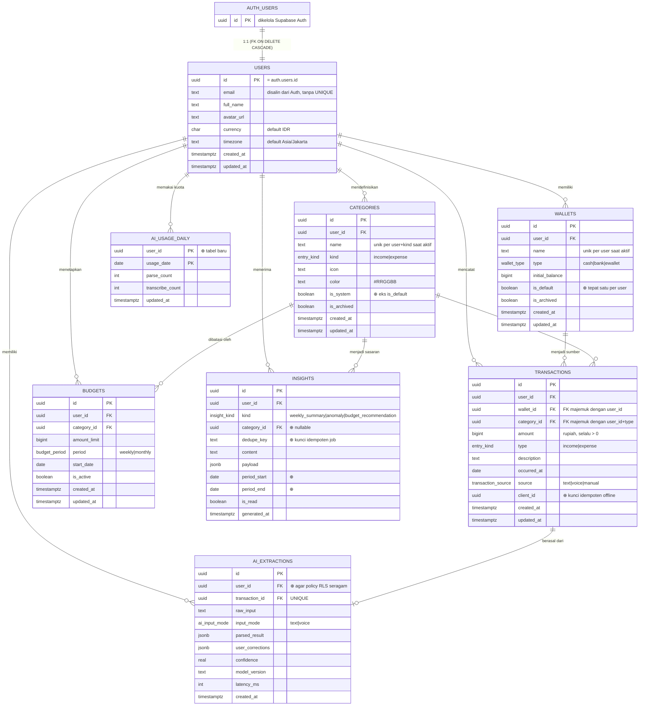
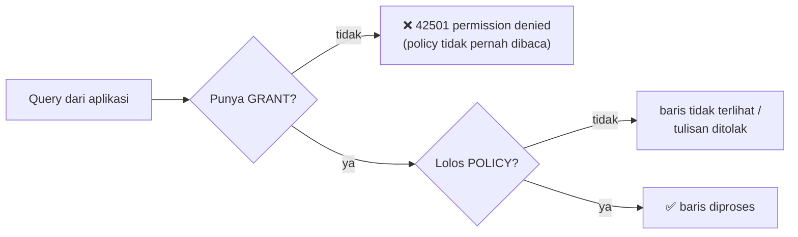
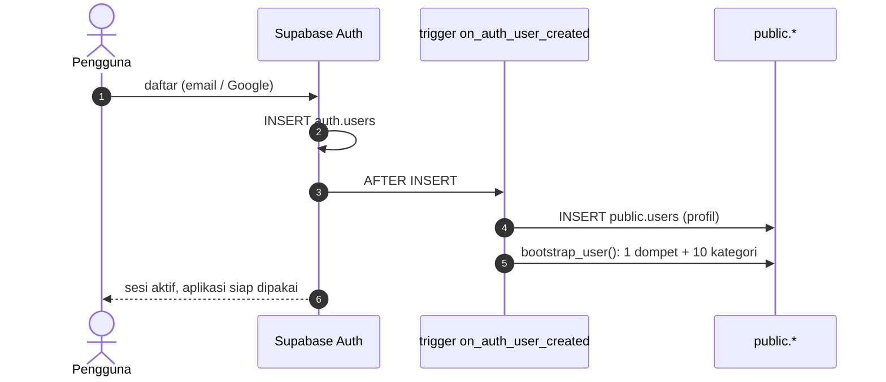

# Rancangan Basis Data — Centsible

**Nama Proyek:** Centsible <br>
**Kelompok:** MDG (My Duit Gweh) <br>
**Dokumen ini adalah deliverable Subproyek "Merancang struktur database"**, kelanjutan dari [Arsitektur Sistem](arsitektur.md) dan ERD awal di [halaman utama §e](index.md#e-entity-relationship-diagram).

Dokumen ini menerjemahkan ERD tingkat konsep menjadi **struktur basis data yang benar-benar bisa dijalankan di Supabase (PostgreSQL)**: tabel, tipe, aturan integritas, indeks, kebijakan keamanan baris, data bawaan, dan cara migrasinya. Setiap keputusan dikaitkan ke Functional Requirement (FR 1–FR 17) dan ke bagian [Arsitektur Sistem](arsitektur.md) yang relevan.

**Berkas yang menyertai dokumen ini:**

| Berkas | Isi |
|---|---|
| `prisma/schema.prisma` | Model untuk Prisma Client (tipe TypeScript & query builder) |
| `prisma/migrations/20260925120000_init_schema/migration.sql` | Enum, tabel, constraint, indeks, trigger `updated_at` |
| `prisma/migrations/20260925120100_grants_and_rls/migration.sql` | `GRANT` + Row Level Security + policy |
| `prisma/migrations/20260925120200_auth_bridge_and_defaults/migration.sql` | Sambungan ke `auth.users`, kategori & dompet bawaan |
| `prisma/migrations/20260925120300_views_and_ai_quota/migration.sql` | View saldo dompet, fungsi kuota AI |

---

## Daftar Isi

1. [Prinsip Rancangan](#1-prinsip-rancangan)
2. [ERD Final](#2-erd-final)
3. [Kamus Data](#3-kamus-data)
4. [Tipe Enum](#4-tipe-enum)
5. [Aturan Integritas yang Dijaga Basis Data](#5-aturan-integritas-yang-dijaga-basis-data)
6. [Indeks dan Alasannya](#6-indeks-dan-alasannya)
7. [Keamanan: GRANT, RLS, dan Prisma](#7-keamanan-grant-rls-dan-prisma)
8. [Data Bawaan Pengguna Baru](#8-data-bawaan-pengguna-baru)
9. [View dan Fungsi](#9-view-dan-fungsi)
10. [Kontrak Kolom JSONB](#10-kontrak-kolom-jsonb)
11. [Alur Tulis per Fitur](#11-alur-tulis-per-fitur)
12. [Query Acuan](#12-query-acuan)
13. [Perubahan terhadap ERD Awal](#13-perubahan-terhadap-erd-awal)
14. [Alur Kerja Migrasi](#14-alur-kerja-migrasi)
15. [Pemetaan FR → Objek Basis Data](#15-pemetaan-fr--objek-basis-data)
16. [Keputusan Rancangan (ADR-DB)](#16-keputusan-rancangan-adr-db)
17. [Risiko dan Batasan yang Diketahui](#17-risiko-dan-batasan-yang-diketahui)

---

## 1. Prinsip Rancangan

Enam prinsip di bawah dipakai sebagai alat putus setiap kali ada dua pilihan rancangan. Semuanya turunan langsung dari prinsip arsitektur P1–P7.

| # | Prinsip | Asal | Wujud konkretnya di basis data |
|---|---|---|---|
| D1 | **Uang adalah bilangan bulat, saldo adalah hasil hitung** | P5, ERD | `bigint` rupiah di semua kolom nominal; tidak ada kolom saldo — saldo lahir dari view `wallet_balances` |
| D2 | **Nominal selalu positif, arah uang dibawa kolom terpisah** | P5 | `transactions.amount > 0`, arah ditentukan `transactions.type` |
| D3 | **Aturan yang tidak boleh dilanggar ditulis sebagai constraint, bukan sebagai komentar** | P4 | FK majemuk, `CHECK`, indeks unik — bukan hanya validasi Zod |
| D4 | **Pemisahan antar-pengguna adalah urusan basis data** | P4, FR 17 | RLS aktif di semua tabel + FK ber-tenant supaya baris milik dua pengguna tidak bisa saling menempel |
| D5 | **Data historis tidak dihapus diam-diam** | ERD | Kategori & dompet yang tidak dipakai diarsipkan (`is_archived`), bukan dihapus; penghapusan yang masih dirujuk ditolak basis data |
| D6 | **Pekerjaan berulang harus idempoten** | §7.3, §7.4 | `transactions.client_id` untuk sinkronisasi offline, `insights.dedupe_key` untuk retry job |

---

## 2. ERD Final

Bagan berikut adalah ERD [§e](index.md#e-entity-relationship-diagram) setelah diturunkan ke tingkat fisik. Kolom **bertanda ⊕** adalah tambahan terhadap ERD awal; alasannya dirinci di [§13](#13-perubahan-terhadap-erd-awal).



---

## 3. Kamus Data

Delapan tabel, semuanya di skema `public`. Kolom bertanda **⊕** adalah tambahan terhadap ERD awal.

### 3.1 `users` — profil pengguna

Baris di tabel ini **tidak pernah dibuat aplikasi**; baris lahir dari trigger `on_auth_user_created` ([§8](#8-data-bawaan-pengguna-baru)) dan mati bersama akun Auth-nya.

| Kolom | Tipe | Null | Default | Keterangan |
|---|---|:-:|---|---|
| `id` | `uuid` PK | tidak | — | Sama persis dengan `auth.users.id`. FK `ON DELETE CASCADE` ke `auth.users` |
| `email` | `text` | ya | — | Salinan untuk tampilan & ekspor. **Tanpa `UNIQUE`** — lihat [§13](#13-perubahan-terhadap-erd-awal) |
| `full_name` | `text` | ya | — | Maks. 120 karakter |
| `avatar_url` | `text` | ya | — | Dari metadata Google OAuth |
| `currency` | `char(3)` | tidak | `'IDR'` | Wajib huruf kapital. Satu mata uang per pengguna (lihat [§17](#17-risiko-dan-batasan-yang-diketahui)) |
| `timezone` | `text` | tidak | `'Asia/Jakarta'` | Dipakai prompt AI untuk menerjemahkan *"kemarin"*, dan untuk batas hari kuota AI |
| `created_at` / `updated_at` | `timestamptz` | tidak | `now()` | `updated_at` dijaga trigger |

### 3.2 `wallets` — dompet (FR 10)

| Kolom | Tipe | Null | Default | Keterangan |
|---|---|:-:|---|---|
| `id` | `uuid` PK | tidak | `gen_random_uuid()` | |
| `user_id` | `uuid` FK | tidak | — | → `users.id`, `ON DELETE CASCADE` |
| `name` | `text` | tidak | — | 1–40 karakter. Unik per pengguna (tanpa beda huruf besar/kecil) selama belum diarsipkan |
| `type` | `wallet_type` | tidak | `'cash'` | `cash` / `bank` / `ewallet` |
| `initial_balance` | `bigint` | tidak | `0` | Saldo awal saat dompet dibuat. Boleh negatif (rekening minus) |
| `is_default` ⊕ | `boolean` | tidak | `false` | Dompet yang dipakai kalau AI tidak menyebut dompet (§6.3). **Tepat satu per pengguna** |
| `is_archived` | `boolean` | tidak | `false` | Dompet arsip tidak muncul di `enum` skema AI dan tidak boleh jadi dompet utama |
| `created_at` / `updated_at` | `timestamptz` | tidak | `now()` | |

### 3.3 `categories` — kategori (FR 9)

| Kolom | Tipe | Null | Default | Keterangan |
|---|---|:-:|---|---|
| `id` | `uuid` PK | tidak | `gen_random_uuid()` | |
| `user_id` | `uuid` FK | tidak | — | → `users.id`, `ON DELETE CASCADE` |
| `name` | `text` | tidak | — | 1–40 karakter. Unik per pengguna **per `kind`** selama belum diarsipkan |
| `kind` | `entry_kind` | tidak | — | `income` / `expense` |
| `icon` | `text` | ya | — | Satu emoji (maks. 8 karakter) |
| `color` | `text` | ya | — | Wajib format `#RRGGBB` |
| `is_system` ⊕ | `boolean` | tidak | `false` | `true` = kategori bawaan hasil `bootstrap_user()`. **Ganti nama** dari `is_default` di ERD agar tidak tertukar makna dengan `wallets.is_default` |
| `is_archived` | `boolean` | tidak | `false` | Kategori nonaktif; transaksi lama tetap utuh (D5) |
| `created_at` / `updated_at` | `timestamptz` | tidak | `now()` | |

> Keunikan nama kategori aktif **bukan** sekadar kerapian: daftar nama kategori aktif dipakai sebagai `enum` pada skema keluaran AI (ADR-06). Dua kategori aktif bernama sama membuat hasil AI tidak bisa dipetakan balik ke satu baris.

### 3.4 `transactions` — tabel inti (FR 3, 4, 8, 16)

| Kolom | Tipe | Null | Default | Keterangan |
|---|---|:-:|---|---|
| `id` | `uuid` PK | tidak | `gen_random_uuid()` | |
| `user_id` | `uuid` FK | tidak | — | → `users.id`, `ON DELETE CASCADE` |
| `wallet_id` | `uuid` FK | tidak | — | FK **majemuk** `(user_id, wallet_id)` → `wallets(user_id, id)` |
| `category_id` | `uuid` FK | tidak | — | FK **majemuk** `(user_id, category_id, type)` → `categories(user_id, id, kind)` |
| `amount` | `bigint` | tidak | — | Rupiah, `> 0` dan `≤ 1.000.000.000.000` |
| `type` | `entry_kind` | tidak | — | Arah uang; wajib sama dengan `kind` kategorinya |
| `description` | `text` | tidak | `''` | Maks. 200 karakter |
| `occurred_at` | `date` | tidak | — | Tanggal kejadian menurut zona waktu pengguna; `≥ 2020-01-01` |
| `source` | `transaction_source` | tidak | `'manual'` | `text` / `voice` / `manual` |
| `client_id` ⊕ | `uuid` | ya | — | UUID dari perangkat. Unik per pengguna → sinkronisasi offline yang terulang tidak menggandakan transaksi (FR 16) |
| `created_at` / `updated_at` | `timestamptz` | tidak | `now()` | `created_at` dipakai mengurutkan transaksi pada tanggal yang sama |

### 3.5 `ai_extractions` — catatan kerja AI (FR 5)

Ditulis **satu kali** bersama transaksinya di dalam satu transaksi database (§6.5), lalu tidak pernah diubah.

| Kolom | Tipe | Null | Default | Keterangan |
|---|---|:-:|---|---|
| `id` | `uuid` PK | tidak | `gen_random_uuid()` | |
| `user_id` ⊕ | `uuid` FK | tidak | — | Didenormalisasi agar policy RLS-nya sama bentuknya dengan tabel lain |
| `transaction_id` | `uuid` FK **UNIQUE** | tidak | — | FK majemuk `(user_id, transaction_id)`, `ON DELETE CASCADE` |
| `raw_input` | `text` | tidak | — | Kalimat asli / hasil transkripsi. 1–1000 karakter |
| `input_mode` | `ai_input_mode` | tidak | — | `text` / `voice` |
| `parsed_result` | `jsonb` | tidak | — | Usulan mentah AI, wajib objek JSON ([§10](#10-kontrak-kolom-jsonb)) |
| `user_corrections` | `jsonb` | tidak | `'{}'` | Hanya isian yang benar-benar diubah pengguna |
| `confidence` | `real` | ya | — | 0–1 |
| `model_version` | `text` | tidak | — | `"<penyedia>:<model>@<versi prompt>"`, mis. `anthropic:claude-opus-5@p3` |
| `latency_ms` | `integer` | ya | — | `≥ 0` |
| `created_at` | `timestamptz` | tidak | `now()` | |

### 3.6 `budgets` — anggaran (FR 11)

| Kolom | Tipe | Null | Default | Keterangan |
|---|---|:-:|---|---|
| `id` | `uuid` PK | tidak | `gen_random_uuid()` | |
| `user_id` | `uuid` FK | tidak | — | → `users.id`, `ON DELETE CASCADE` |
| `category_id` | `uuid` FK | tidak | — | FK majemuk `(user_id, category_id)`, `ON DELETE CASCADE` |
| `amount_limit` | `bigint` | tidak | — | `> 0` |
| `period` | `budget_period` | tidak | — | `weekly` / `monthly` |
| `start_date` | `date` | tidak | — | Tanggal pagu mulai berlaku |
| `is_active` | `boolean` | tidak | `true` | Menonaktifkan pagu tanpa menghapus barisnya |
| `created_at` / `updated_at` | `timestamptz` | tidak | `now()` | |

> **Satu pagu per kategori per periode** (`UNIQUE (user_id, category_id, period)`). Mengubah pagu = `UPDATE` baris yang sama, bukan menambah baris baru. Ini membuat pertanyaan *"berapa pagu Makan bulan ini?"* selalu punya satu jawaban.

### 3.7 `insights` — keluaran job terjadwal (FR 13, 14)

| Kolom | Tipe | Null | Default | Keterangan |
|---|---|:-:|---|---|
| `id` | `uuid` PK | tidak | `gen_random_uuid()` | |
| `user_id` | `uuid` FK | tidak | — | → `users.id`, `ON DELETE CASCADE` |
| `kind` | `insight_kind` | tidak | — | `weekly_summary` / `anomaly` / `budget_recommendation` |
| `category_id` ⊕ | `uuid` FK | ya | — | Diisi untuk anomali & saran anggaran; `NULL` untuk ringkasan mingguan |
| `dedupe_key` ⊕ | `text` | tidak | — | Unik per pengguna. Contoh `weekly_summary:2026-09-21`, `anomaly:2026-09-24:<category_id>` |
| `content` | `text` | tidak | — | Kalimat siap tampil, 1–4000 karakter |
| `payload` | `jsonb` | tidak | `'{}'` | Angka pendukung ([§10](#10-kontrak-kolom-jsonb)) |
| `period_start` / `period_end` ⊕ | `date` | ya | — | Rentang yang diringkas; `period_end ≥ period_start` |
| `is_read` | `boolean` | tidak | `false` | Satu-satunya kolom yang boleh diubah pengguna |
| `generated_at` | `timestamptz` | tidak | `now()` | |

### 3.8 `ai_usage_daily` ⊕ — kuota pemakaian AI

Tabel sistem, bukan data pengguna. Memenuhi §6.1 langkah 2 dan §8.1 ("kuota per pengguna per hari").

| Kolom | Tipe | Null | Default | Keterangan |
|---|---|:-:|---|---|
| `user_id` + `usage_date` | `uuid` + `date` | tidak | — | PK gabungan |
| `parse_count` | `integer` | tidak | `0` | Jumlah panggilan `/api/ai/parse` hari itu |
| `transcribe_count` | `integer` | tidak | `0` | Jumlah panggilan `/api/ai/transcribe` hari itu |
| `updated_at` | `timestamptz` | tidak | `now()` | |

> Pengguna hanya bisa **membaca** barisnya sendiri. Penambahan hanya lewat `public.consume_ai_quota()` ([§9](#9-view-dan-fungsi)), jadi kuota tidak bisa dinolkan sendiri lewat Data API.

---

## 4. Tipe Enum

Enam tipe enum PostgreSQL. Memakai enum (bukan `text` + `CHECK`) membuat nilai tak dikenal ditolak basis data dan tipenya ikut terbawa ke TypeScript lewat Prisma.

| Tipe | Nilai | Dipakai di |
|---|---|---|
| `entry_kind` | `income`, `expense` | `categories.kind` **dan** `transactions.type` |
| `wallet_type` | `cash`, `bank`, `ewallet` | `wallets.type` |
| `transaction_source` | `text`, `voice`, `manual` | `transactions.source` |
| `ai_input_mode` | `text`, `voice` | `ai_extractions.input_mode` |
| `budget_period` | `weekly`, `monthly` | `budgets.period` |
| `insight_kind` | `weekly_summary`, `anomaly`, `budget_recommendation` | `insights.kind` |

> `categories.kind` dan `transactions.type` sengaja memakai **satu tipe yang sama** (`entry_kind`). Tanpa itu keduanya tidak bisa diikat dalam satu foreign key majemuk, dan aturan "transaksi pengeluaran wajib memakai kategori pengeluaran" hanya bisa dijaga kode.

> Menambah nilai enum di kemudian hari cukup `ALTER TYPE ... ADD VALUE`, dan sifatnya *additive* — sesuai aturan migrasi di §9.2 arsitektur. **Menghapus** nilai enum jauh lebih mahal, jadi nilai baru hanya ditambahkan kalau benar-benar dipakai.

---

## 5. Aturan Integritas yang Dijaga Basis Data

### 5.1 Foreign key ber-tenant

Ini bagian paling penting dari rancangan ini. RLS hanya memeriksa `user_id` pada baris yang sedang ditulis — RLS **tidak** memeriksa apakah `wallet_id` yang ikut ditulis benar-benar milik orang yang sama. Tanpa perlindungan tambahan, pengguna A yang mengetahui UUID dompet pengguna B bisa menyisipkan transaksinya sendiri ke dompet B dan mengacaukan saldo B.

Karena itu semua FK antar-tabel pengguna dibuat **majemuk, selalu menyertakan `user_id`**:

| Constraint | Kunci | Aturan yang dijamin |
|---|---|---|
| `transactions_wallet_fkey` | `(user_id, wallet_id)` → `wallets(user_id, id)` | Dompet wajib milik pemilik transaksi |
| `transactions_category_fkey` | `(user_id, category_id, type)` → `categories(user_id, id, kind)` | Kategori wajib milik pemilik transaksi **dan** jenisnya wajib cocok |
| `ai_extractions_transaction_fkey` | `(user_id, transaction_id)` → `transactions(user_id, id)` | Catatan AI wajib menempel pada transaksi pemiliknya |
| `budgets_category_fkey` | `(user_id, category_id)` → `categories(user_id, id)` | Pagu wajib menunjuk kategori pemiliknya |
| `insights_category_fkey` | `(user_id, category_id)` → `categories(user_id, id)` | Sama; `category_id` boleh `NULL` (FK majemuk `MATCH SIMPLE` otomatis lolos bila ada kolom `NULL`) |

Biayanya hanya beberapa indeks unik tambahan (`wallets(user_id, id)`, `categories(user_id, id)`, `categories(user_id, id, kind)`, `transactions(user_id, id)`) yang ukurannya kecil.

### 5.2 Kenapa dua FK itu `DEFERRABLE INITIALLY DEFERRED`

`transactions_wallet_fkey` dan `transactions_category_fkey` memakai `ON DELETE NO ACTION` supaya dompet/kategori yang masih dipakai tidak bisa dihapus (D5). Tetapi saat **akun dihapus**, `users → wallets` dan `users → transactions` sama-sama `CASCADE`, dan PostgreSQL tidak menjamin cascade transaksi dijalankan lebih dulu. Kalau cascade dompet jalan duluan, pemeriksaan `NO ACTION` akan melihat transaksi yang sebentar lagi ikut terhapus dan menolak penghapusan akun.

`DEFERRABLE INITIALLY DEFERRED` menunda pemeriksaan sampai `COMMIT`, saat semua baris sudah benar-benar hilang. Ini alasan yang sama mengapa dipakai `NO ACTION`, bukan `RESTRICT`: dokumentasi PostgreSQL menyebut *"`RESTRICT` does not allow the check to be deferred until later in the transaction."*

**Konsekuensi praktis:** kesalahan "dompet masih dipakai" baru muncul saat `COMMIT`, bukan saat `DELETE`. Karena itu Server Action penghapusan dompet/kategori sebaiknya **menghitung dulu** jumlah transaksinya dan menawarkan "Arsipkan" — pesan yang ramah, bukan error mentah.

### 5.3 CHECK constraint

| Tabel | Constraint | Alasan |
|---|---|---|
| `transactions` | `amount > 0 and amount <= 1e12` | D2. Batas atas menangkap salah baca ekstrem AI |
| `transactions` | `char_length(description) <= 200` | Membatasi ukuran baris & ekspor CSV |
| `transactions` | `occurred_at >= '2020-01-01'` | Menangkap salah tafsir tanggal relatif yang parah |
| `budgets` | `amount_limit > 0`, `start_date >= '2020-01-01'` | Pagu nol/negatif tidak punya arti |
| `wallets` | `initial_balance` dalam ±1e12 | Pagar kewarasan |
| `wallets` | `not (is_default and is_archived)` | Dompet arsip tidak boleh jadi dompet utama |
| `categories` | `color ~ '^#[0-9A-Fa-f]{6}$'` | UI boleh memakai nilainya langsung tanpa sanitasi |
| `ai_extractions` | `confidence between 0 and 1`, `latency_ms >= 0` | Data metrik harus masuk akal |
| `ai_extractions`, `insights` | `jsonb_typeof(kolom) = 'object'` | Kolom JSONB wajib objek, bukan array/angka — menjaga kontrak [§10](#10-kontrak-kolom-jsonb) |
| `users` | `currency = upper(currency)` | Mencegah `idr` vs `IDR` |

### 5.4 Batas atas tanggal tidak bisa jadi CHECK

`occurred_at` tidak boleh di masa depan (§6.3), tetapi `CHECK (occurred_at <= current_date)` **tidak sah** di PostgreSQL karena `current_date` tidak *immutable*. Aturan ini karena itu dijaga di lapisan aplikasi (skema Zod bersama form manual dan keluaran AI). Daftar lengkap aturan yang sengaja tidak jadi constraint ada di [§17](#17-risiko-dan-batasan-yang-diketahui).

---

## 6. Indeks dan Alasannya

Setiap policy RLS memfilter `user_id`, jadi **kolom `user_id` harus selalu jadi kolom terdepan** — kalau tidak, setiap pembacaan berubah jadi *sequential scan* setelah kebijakan RLS diterapkan.

| Indeks | Kolom | Melayani |
|---|---|---|
| `transactions_user_occurred_idx` | `(user_id, occurred_at ↓, created_at ↓)` | Daftar transaksi & dashboard (FR 8, 12) — jalur paling sering |
| `transactions_user_category_idx` | `(user_id, category_id, occurred_at ↓)` | Filter kategori, pemakaian anggaran, deteksi anomali (FR 8, 11, 14) |
| `transactions_user_wallet_idx` | `(user_id, wallet_id, occurred_at ↓)` | Filter dompet + view saldo (FR 8, 10) |
| `transactions_user_type_idx` | `(user_id, type, occurred_at ↓)` | Total pemasukan vs pengeluaran per periode (FR 12) |
| `transactions_user_id_client_id_key` | `UNIQUE (user_id, client_id)` | *Upsert* idempoten sinkronisasi offline (FR 16) |
| `categories_active_name_per_user_idx` | `UNIQUE (user_id, kind, lower(btrim(name))) WHERE NOT is_archived` | Menjamin `enum` kategori AI tidak ambigu (ADR-06) |
| `wallets_one_default_per_user_idx` | `UNIQUE (user_id) WHERE is_default` | Tepat satu dompet utama |
| `wallets_active_name_per_user_idx` | `UNIQUE (user_id, lower(btrim(name))) WHERE NOT is_archived` | Nama dompet tidak ambigu |
| `budgets_user_active_idx` | `(user_id) WHERE is_active` | Halaman laporan hanya membaca pagu aktif |
| `insights_user_generated_idx` / `insights_user_unread_idx` | `(user_id, generated_at ↓)` (+ parsial belum dibaca) | Daftar insight & lencana notifikasi |
| `ai_extractions_model_mode_idx` | `(model_version, input_mode, created_at ↓)` | Evaluasi akurasi AI per model & per jenis input (§10.2) |
| `users_email_idx` | `(email)` | Pencarian manual saat dukungan/debug |

Indeks unik ber-tenant (`wallets(user_id, id)`, `categories(user_id, id)`, `categories(user_id, id, kind)`, `transactions(user_id, id)`) ada demi foreign key [§5.1](#51-foreign-key-ber-tenant), dan kebetulan juga mempercepat penyaringan per pengguna.

> **Indeks parsial dan indeks berbasis ekspresi sengaja dipakai.** Keduanya tidak bisa diwakili Prisma Schema dengan aman, jadi hanya hidup di SQL. Konsekuensinya dibahas di [§14](#14-alur-kerja-migrasi).

---

## 7. Keamanan: GRANT, RLS, dan Prisma

### 7.1 Dua lapis yang harus benar dua-duanya



Kesalahan paling sering saat memakai RLS adalah mengira policy saja cukup. **`GRANT` diperiksa lebih dulu**; tanpa hak tabel, PostgreSQL menolak dengan `42501` sebelum satu policy pun dibaca.

Ini bukan hal teoretis: sejak **30 Mei 2026** project Supabase baru **tidak lagi** memberi hak otomatis ke `anon`/`authenticated` untuk tabel baru di skema `public`. Karena itu semua `GRANT` ditulis eksplisit di migrasi 02 dan **harus ikut ditulis untuk setiap tabel baru di kemudian hari**.

### 7.2 Peta hak akses

| Tabel | `anon` | `authenticated` | `service_role` |
|---|---|---|---|
| `users` | — | `select`, `update (full_name, avatar_url, currency, timezone)` | penuh |
| `wallets`, `categories`, `transactions`, `budgets` | — | `select, insert, update, delete` | penuh |
| `ai_extractions` | — | `select, insert` | penuh |
| `insights` | — | `select`, `update (is_read)` | penuh |
| `ai_usage_daily` | — | `select` | penuh |
| `wallet_balances` (view) | — | `select` | `select` |

Tiga keputusan yang perlu disorot:

1. **`anon` tidak mendapat apa pun.** Seluruh data Centsible milik pengguna yang sudah masuk; tidak ada halaman publik yang membaca tabel.
2. **Hak `update` dipersempit ke kolom.** Pengguna hanya boleh mengubah kolom profil yang memang miliknya (bukan `email` yang disalin dari Auth, bukan `created_at`), dan pada `insights` hanya boleh menandai sudah dibaca. Pengetatan ini gratis: `GRANT UPDATE (kolom)` adalah fitur PostgreSQL biasa.
3. **`ai_extractions` tidak bisa diubah/dihapus pengguna.** Tabel itu adalah alat ukur akurasi AI (§10.2); kalau pengguna bisa menyuntingnya, angka akurasinya tidak lagi bisa dipercaya. Penghapusan tetap terjadi otomatis lewat cascade ketika transaksinya dihapus.

### 7.3 Pola policy

Semua policy memakai pola yang sama persis:

```sql
create policy transactions_select_own on public.transactions
  for select to authenticated
  using ((select auth.uid()) = user_id);

create policy transactions_insert_own on public.transactions
  for insert to authenticated
  with check ((select auth.uid()) = user_id);
```

| Unsur | Kenapa |
|---|---|
| `to authenticated` | Policy tidak ikut berlaku untuk role lain yang tidak diniatkan |
| `(select auth.uid())` — dibungkus `select` | Membuat PostgreSQL menghitungnya **sekali per statement** (`initPlan`), bukan sekali per baris. Pada daftar transaksi yang panjang, bedanya besar |
| Satu policy per operasi | PostgreSQL tidak menerima beberapa operasi dalam satu `for`, dan policy terpisah lebih mudah diaudit |
| `with check` pada `insert`/`update` | Tanpa ini pengguna bisa **memindahkan** barisnya ke `user_id` orang lain |

`auth.uid()` membaca GUC `request.jwt.claims`. GUC itu diisi PostgREST pada jalur Supabase client, **dan** diisi sendiri oleh `withRls()` pada jalur Prisma — jadi satu policy melayani kedua jalur.

### 7.4 Jebakan Prisma vs RLS, dan cara menutupnya

Prisma tersambung sebagai role `postgres`, yaitu **pemilik tabel**. Pemilik tabel melewati RLS. Artinya `prisma.transaction.findMany()` biasa akan membaca data semua pengguna — FR 17 tidak terpenuhi.

Penutupnya (§8.2 arsitektur): jalankan setiap query pengguna di dalam satu transaksi yang berganti role dan membawa klaim JWT.

```ts
// src/server/db/with-rls.ts
import "server-only";
import type { Prisma } from "@/generated/prisma/client";
import { prisma } from "./client";

export type RlsTx = Prisma.TransactionClient;

/**
 * Menjalankan fn() sebagai role `authenticated` dengan klaim JWT pengguna,
 * sehingga policy RLS di basis data yang menentukan baris mana yang terlihat.
 * `set local` + set_config(..., true) otomatis kembali saat transaksi selesai,
 * jadi tidak ada kebocoran antar-request.
 */
export async function withRls<T>(
  claims: Record<string, unknown>,
  fn: (tx: RlsTx) => Promise<T>,
): Promise<T> {
  return prisma.$transaction(async (tx) => {
    await tx.$executeRaw`select set_config('request.jwt.claims', ${JSON.stringify(claims)}, true)`;
    // Bukan nilai dari pengguna — konstanta. `set local role` tidak bisa memakai parameter.
    await tx.$executeRawUnsafe("set local role authenticated");
    return fn(tx);
  });
}
```

Aturan pemakaiannya:

| Jalur | Klien | Alasan |
|---|---|---|
| Semua Server Action & Route Handler yang melayani pengguna | **`withRls()`** | Basis data yang menolak akses lintas pengguna, bukan `where userId` |
| Migrasi | Prisma CLI (role `postgres`) | Memang perlu hak penuh |
| Job terjadwal FR 13/14 | Prisma biasa tanpa `withRls` | Memang perlu membaca semua pengguna (§8.2) |

`FORCE ROW LEVEL SECURITY` sengaja **tidak** dipasang, justru supaya jalur job terjadwal tetap bisa bekerja.

> **Sisa risiko yang perlu disadari:** kalau suatu saat ada kode jalur pengguna yang lupa memakai `withRls()`, query itu akan berhasil dan membaca lintas pengguna. Pengetatan lanjutan yang disarankan sebelum uji coba pengguna nyata (Subproyek H): buat satu role login khusus aplikasi yang **bukan pemilik tabel**, tanpa `BYPASSRLS`, dan tanpa `GRANT` langsung ke tabel — anggota role `authenticated` saja. Dengan begitu query yang lupa `withRls()` **gagal** dengan `42501`, bukan diam-diam membocorkan data. Perubahan ini hanya menyentuh `DATABASE_URL`, tidak menyentuh skema.

---

## 8. Data Bawaan Pengguna Baru

FR 9 dan FR 10 mensyaratkan pengguna baru langsung punya kategori dan dompet. Kalau tidak, skema keluaran AI akan punya `enum` kosong dan transaksi pertama tidak mungkin disimpan.



**Kategori bawaan** (`is_system = true`, bisa diarsipkan pengguna kapan saja):

| `kind` | Kategori |
|---|---|
| `expense` | Makan 🍚 · Transport 🛵 · Kos 🏠 · Kuliah 🎓 · Hiburan 🎮 · Kesehatan 💊 · Lain-lain 📦 |
| `income` | Uang Saku 💸 · Freelance 💼 · Lain-lain 📥 |

Tujuh kategori pengeluaran persis mengikuti daftar di FR 9. Tiga kategori pemasukan **ditambahkan** karena setiap transaksi wajib punya kategori, dan kategori pemasukan tidak bisa dipinjam dari daftar pengeluaran (dijaga FK majemuk [§5.1](#51-foreign-key-ber-tenant)).

**Dompet bawaan:** satu dompet `Tunai` bertipe `cash`, `is_default = true`, saldo awal `0`.

Tiga hal yang membuat trigger ini aman:

- `bootstrap_user()` **idempoten** (`ON CONFLICT DO NOTHING`), jadi aman dipanggil ulang untuk memperbaiki akun yang datanya belum lengkap.
- Fungsinya `SECURITY DEFINER` dengan `set search_path = ''` dan seluruh nama objek ditulis lengkap — pola resmi Supabase untuk mencegah pembajakan lewat `search_path`.
- Hak `EXECUTE` `bootstrap_user(uuid)` **dicabut** dari `public`/`anon`/`authenticated`. Fungsi `SECURITY DEFINER` yang menerima `user_id` sebagai parameter dan bisa dipanggil siapa saja adalah lubang keamanan: orang bisa membuat data atas nama pengguna lain.

Migrasi 03 juga melakukan **backfill** untuk akun yang sudah terlanjur ada sebelum migrasi dijalankan, supaya tidak ada pengguna yang tertinggal tanpa kategori.

---

## 9. View dan Fungsi

### 9.1 `wallet_balances` — saldo dihitung, bukan disimpan (FR 10, D1)

```sql
create view public.wallet_balances
with (security_invoker = true) as
select
  w.id as wallet_id, w.user_id, w.name, w.type,
  w.is_default, w.is_archived, w.initial_balance,
  w.initial_balance
    + coalesce(sum(case when t.type = 'income' then t.amount else -t.amount end), 0) as balance,
  count(t.id) as transaction_count,
  max(t.occurred_at) as last_occurred_at
from public.wallets w
left join public.transactions t on t.wallet_id = w.id and t.user_id = w.user_id
group by w.id;
```

**`security_invoker = true` adalah bagian yang paling mudah terlupa dan paling berbahaya kalau terlupa.** View PostgreSQL secara bawaan dieksekusi dengan hak *pemiliknya*. Tanpa opsi ini, view akan membaca tabel di bawahnya sebagai `postgres` — RLS dilewati, dan setiap pengguna melihat saldo semua orang. Dengan `security_invoker`, policy `transactions` dan `wallets` tetap berlaku untuk siapa pun yang membaca view.

### 9.2 `consume_ai_quota(p_kind, p_limit)` — penjaga biaya AI

Memenuhi §6.1 langkah 2 dan §8.1. Dipanggil **sebelum** memanggil penyedia AI:

```sql
select public.consume_ai_quota('parse', 100);  -- mengembalikan sisa kuota hari ini
```

| Sifat | Penjelasan |
|---|---|
| Atomik | Satu `INSERT ... ON CONFLICT DO UPDATE ... RETURNING` — aman terhadap dua permintaan bersamaan |
| Tidak bisa diakali | Penghitungnya ada di tabel yang tidak bisa ditulis role `authenticated`; satu-satunya jalan naik adalah lewat fungsi ini |
| Sadar zona waktu | Batas hari memakai `users.timezone`, bukan UTC, jadi kuota berganti pada tengah malam waktu pengguna |
| Gagal dengan jelas | Kuota habis → `SQLSTATE 53400`; tanpa sesi → `28000`. Keduanya dipetakan ke pesan + fallback form manual (§6.4) |

---

## 10. Kontrak Kolom JSONB

Tiga kolom `jsonb` (`parsed_result`, `user_corrections`, `payload`) fleksibel di basis data, jadi bentuknya harus disepakati di dokumen ini — kalau tidak, query evaluasi akurasi di [§12](#12-query-acuan) akan patah. Semuanya sudah dipaksa berbentuk objek lewat `CHECK jsonb_typeof(...) = 'object'`.

**`ai_extractions.parsed_result`** — usulan mentah AI, persis bentuk skema keluaran §6.1:

```json
{
  "amount": 50000,
  "type": "expense",
  "category": "Transport",
  "wallet": "Tunai",
  "description": "beli bensin",
  "occurred_at": "2026-09-25",
  "confidence": 0.92
}
```

**`ai_extractions.user_corrections`** — **hanya** isian yang benar-benar diubah pengguna. Objek kosong `{}` berarti usulan AI diterima apa adanya:

```json
{ "amount": { "from": 50000, "to": 55000 },
  "category": { "from": "Transport", "to": "Makan" } }
```

Kunci yang dipakai sama persis dengan kunci `parsed_result`. Inilah yang membuat pertanyaan FR 5 — *"berapa persen transaksi yang nominal & kategorinya tidak perlu dibetulkan?"* — bisa dijawab satu query.

**`insights.payload`** — angka pendukung, berbeda per `kind`:

| `kind` | Isi `payload` |
|---|---|
| `weekly_summary` | `{ "total_expense": …, "total_income": …, "per_category": [{ "category_id": …, "total": …, "delta_pct": … }] }` |
| `anomaly` | `{ "category_id": …, "amount": …, "median": …, "mad": …, "ratio": 3.1 }` |
| `budget_recommendation` | `{ "category_id": …, "current_limit": …, "suggested_limit": …, "reason": "…" }` |

---

## 11. Alur Tulis per Fitur

### 11.1 Simpan transaksi dari AI (FR 4, 5 · §7.1)

Satu transaksi database, dua tabel — supaya tidak mungkin ada transaksi tanpa catatan AI-nya, atau sebaliknya:

```ts
await withRls(claims, async (tx) => {
  const trx = await tx.transaction.create({ data: nilaiAkhir });
  await tx.aiExtraction.create({
    data: {
      userId: trx.userId,
      transactionId: trx.id,
      rawInput, inputMode, parsedResult, userCorrections,
      confidence, modelVersion, latencyMs,
    },
  });
  return trx;
});
```

Kalau `INSERT` kedua gagal, yang pertama ikut dibatalkan. Endpoint AI sendiri **tidak pernah** menulis ke `transactions` (P1) — penulisan hanya terjadi di sini, setelah tombol Simpan.

### 11.2 Sinkronisasi antrean offline (FR 16 · §7.4)

```ts
await tx.transaction.upsert({
  where: { userId_clientId: { userId, clientId } },  // UNIQUE (user_id, client_id)
  create: { ...data, userId, clientId },
  update: { ...data },
});
```

`client_id` dibuat di perangkat saat transaksi masuk antrean. Sinkronisasi yang terulang (koneksi putus-nyambung, Background Sync yang dijalankan dua kali) menghasilkan baris yang sama, bukan baris ganda. Transaksi online biasa membiarkan `client_id` `NULL`; karena PostgreSQL menganggap dua `NULL` berbeda, tidak ada batasan berapa banyak transaksi online yang boleh dibuat.

### 11.3 Job mingguan (FR 13 · §7.3)

```ts
await prisma.insight.upsert({                    // tanpa withRls: job membaca semua pengguna
  where: { userId_dedupeKey: { userId, dedupeKey: `weekly_summary:${awalMinggu}` } },
  create: { userId, kind: "weekly_summary", dedupeKey, content, payload, periodStart, periodEnd },
  update: { content, payload },
});
```

`dedupe_key` membuat retry job tidak menggandakan insight — syarat idempotensi di §7.3.

### 11.4 Hapus akun (FR 1 · §7.5)

`auth.admin.deleteUser()` → cascade `auth.users` → `public.users` → seluruh tabel. Tidak ada kode pembersihan manual yang bisa lupa satu tabel. Inilah alasan **semua** FK ke `users` memakai `ON DELETE CASCADE`.

---

## 12. Query Acuan

Query di bawah adalah acuan bentuk untuk pengerjaan iterasi berikutnya, bukan kode final. Semuanya dijalankan lewat `withRls()` (kecuali yang ditandai job).

**Dashboard periode berjalan (FR 12)**

```sql
select
  sum(amount) filter (where type = 'income')  as total_masuk,
  sum(amount) filter (where type = 'expense') as total_keluar
from public.transactions
where occurred_at between $1 and $2;   -- user_id tidak perlu ditulis: RLS yang menyaring
```

**Pemakaian anggaran (FR 11)** — rentang periode dihitung di aplikasi memakai `users.timezone`:

```sql
select b.category_id, b.amount_limit,
       coalesce(sum(t.amount), 0) as terpakai
from public.budgets b
left join public.transactions t
       on t.category_id = b.category_id
      and t.type = 'expense'
      and t.occurred_at between $1 and $2
where b.is_active
group by b.id;
```

**Deteksi anomali (FR 14, ADR-07)** — median + *median absolute deviation*, dijalankan job:

```sql
with mingguan as (
  select category_id, date_trunc('week', occurred_at)::date as minggu, sum(amount) as total
  from public.transactions
  where user_id = $1 and type = 'expense'
    and occurred_at >= current_date - interval '8 weeks'
  group by 1, 2
),
med as (
  select category_id, percentile_cont(0.5) within group (order by total) as median
  from mingguan group by 1
),
mad as (
  select m.category_id,
         percentile_cont(0.5) within group (order by abs(m.total - d.median)) as mad
  from mingguan m join med d using (category_id)
  group by 1
)
select m.category_id, m.total, d.median, a.mad
from mingguan m
join med d using (category_id)
join mad a using (category_id)
where m.minggu = date_trunc('week', current_date)::date
  and m.total > d.median + 3 * 1.4826 * a.mad;   -- ambang MAD yang lazim
```

Konstanta `1,4826` menyetarakan MAD dengan simpangan baku pada sebaran normal; pengali `3` adalah ambang yang perlu **diuji dan disetel** memakai data uji coba, bukan angka final.

**Akurasi AI (§10.2)**

```sql
select
  model_version,
  input_mode,
  count(*) as total,
  count(*) filter (
    where not jsonb_exists(user_corrections, 'amount')
      and not jsonb_exists(user_corrections, 'category')
  ) as tanpa_koreksi,
  round(100.0 * count(*) filter (
    where not jsonb_exists(user_corrections, 'amount')
      and not jsonb_exists(user_corrections, 'category')
  ) / nullif(count(*), 0), 1) as akurasi_persen
from public.ai_extractions
group by 1, 2
order by 1, 2;
```

> Dipakai `jsonb_exists(kolom, 'kunci')`, bukan operator `?`. Tanda `?` bentrok dengan penanda parameter di beberapa klien PostgreSQL dan membuat query yang sama gagal saat dijalankan lewat Prisma.

**Ekspor CSV (FR 15)** — dialirkan sebagai *stream*, jadi rentang tanggal wajib ada:

```sql
select t.occurred_at, t.type, c.name as kategori, w.name as dompet, t.amount, t.description
from public.transactions t
join public.categories c on c.id = t.category_id
join public.wallets    w on w.id = t.wallet_id
where t.occurred_at between $1 and $2
order by t.occurred_at, t.created_at;
```

---

## 13. Perubahan terhadap ERD Awal

ERD di [§e](index.md#e-entity-relationship-diagram) tetap menjadi acuan konsep. Perubahan di bawah muncul saat menurunkannya ke tingkat fisik; semuanya punya rujukan ke FR atau ke bagian arsitektur yang sudah disetujui. **Tidak ada entitas ERD yang dihapus.**

| # | Perubahan | Jenis | Alasan | Rujukan |
|---|---|---|---|---|
| 1 | `ai_extractions.user_id` | tambah kolom | Tanpa kolom ini, policy RLS-nya harus menempuh sub-query ke `transactions` — lebih lambat dan berbeda bentuk dari tujuh tabel lain. Juga menjadi bahan FK ber-tenant | FR 17, §8.1 |
| 2 | `transactions.client_id` | tambah kolom | Kunci idempoten sinkronisasi offline. Arsitektur sudah menyebutnya, ERD belum memuatnya | FR 16, §7.4 |
| 3 | `wallets.is_default` | tambah kolom | §6.3 mensyaratkan "dompet `null` → isi dompet default pengguna". Tanpa kolom ini aturan itu tidak punya sumber data | FR 10, §6.3 |
| 4 | `categories.is_default` → **`categories.is_system`** | ganti nama | Di ERD, `is_default` pada kategori berarti "kategori bawaan", sedangkan `is_default` pada dompet berarti "dompet yang dipilih otomatis". Dua makna berbeda dengan satu nama adalah sumber bug yang mahal | kejelasan |
| 5 | `insights.dedupe_key` | tambah kolom | §7.3 mensyaratkan job idempoten. `UNIQUE (user_id, dedupe_key)` membuat retry tidak menggandakan insight | FR 13, §7.3 |
| 6 | `insights.period_start`, `insights.period_end` | tambah kolom | Menjawab "insight ini meringkas rentang kapan" tanpa membongkar `payload` | FR 13 |
| 7 | `insights.category_id` (nullable) | tambah kolom | Anomali dan saran anggaran selalu menyasar satu kategori. Sebagai kolom asli, relasinya ikut terjaga saat kategori dihapus | FR 11, 14 |
| 8 | Tabel **`ai_usage_daily`** | tambah tabel | §6.1 langkah 2 dan §8.1 mensyaratkan kuota AI per pengguna per hari. Tidak bisa diturunkan dari `ai_extractions`, karena tabel itu hanya merekam panggilan yang **jadi** disimpan | §6.1, §8.1 |
| 9 | `users.email` **tanpa `UNIQUE`** | longgarkan | Keunikan email sudah dijamin `auth.users`. Menduplikasinya di sini hanya menambah satu cara baru bagi trigger pendaftaran untuk gagal — dan trigger yang gagal memblokir pendaftaran | FR 1 |
| 10 | `created_at` / `updated_at` dilengkapi di semua tabel | tambah kolom | ERD hanya memuat sebagian. `updated_at` dijaga trigger, bukan hanya oleh Prisma, supaya tetap benar saat baris diubah job atau SQL | perawatan |
| 11 | Satu tipe enum `entry_kind` untuk `categories.kind` **dan** `transactions.type` | penyatuan tipe | Prasyarat FK majemuk yang mengikat jenis transaksi ke jenis kategori. Tanpa itu, aturan ini hanya bisa dijaga kode | [§5.1](#51-foreign-key-ber-tenant) |
| 12 | `transactions.description` `NOT NULL DEFAULT ''` | perketat | Menghilangkan penanganan `null` di UI, agregasi, dan ekspor CSV | kesederhanaan |
| 13 | `transactions.amount` wajib `> 0` | perketat | Arah uang sudah dibawa `type`; nominal negatif akan membuat dua cara merepresentasikan hal yang sama | P5 (D2) |

> Kalau tim setuju, ERD di `docs/index.md` §e sebaiknya disamakan dengan bagan [§2](#2-erd-final) agar dokumen SDLC dan basis data tidak berbeda. Perubahan itu **belum** dilakukan di dokumen ini karena `index.md` adalah deliverable subproyek lain.

---

## 14. Alur Kerja Migrasi

### 14.1 Keputusan: SQL ditulis tangan, diterapkan `prisma migrate deploy`

Rancangan ini banyak memakai kemampuan PostgreSQL yang **tidak bisa diwakili Prisma Schema**: policy RLS, trigger, fungsi, view, indeks parsial & berbasis ekspresi, `CHECK`, FK majemuk, dan FK `DEFERRABLE`. Karena itu:

| Aturan | Alasan |
|---|---|
| Berkas `migration.sql` **ditulis tangan** dan menjadi sumber kebenaran struktur | Semua fitur PostgreSQL bisa dipakai tanpa kompromi |
| `prisma/schema.prisma` **mengikuti** SQL, hanya untuk Prisma Client | Prisma Client hanya butuh nama tabel/kolom, tipe, dan relasi — indeks, policy, dan constraint tidak memengaruhi kode yang dihasilkannya |
| Penerapan memakai **`prisma migrate deploy`** | Menerapkan berkas apa adanya, mencatatnya di `_prisma_migrations`, tanpa *shadow database* dan tanpa deteksi *drift* |
| **`prisma migrate dev` tidak pernah dijalankan** | Perintah itu membandingkan basis data dengan `schema.prisma`. Semua objek di atas akan dianggap "drift" dan Prisma akan menawarkan **reset database**. Sejak Prisma 7.4 indeks parsial pun ikut terdeteksi sebagai drift |

Peringatan yang sama ditulis sebagai komentar di kepala `prisma/schema.prisma`, supaya terbaca orang yang membuka berkas itu lebih dulu.

### 14.2 Menyiapkan Prisma (dikerjakan bersama subproyek "Config Supabase")

```bash
pnpm add @prisma/client @prisma/adapter-pg
pnpm add -D prisma
```

`prisma.config.ts` di akar proyek (Prisma 7 tidak lagi menerima `url` di dalam `schema.prisma`):

```ts
import "dotenv/config";
import { defineConfig, env } from "prisma/config";

export default defineConfig({
  schema: "prisma/schema.prisma",
  migrations: { path: "prisma/migrations" },
  datasource: { url: env("DIRECT_URL") },   // migrasi butuh koneksi non-pooled
});
```

Tambahan di `package.json`:

```json
{
  "scripts": {
    "db:generate": "prisma generate",
    "db:deploy": "prisma migrate deploy",
    "db:status": "prisma migrate status",
    "postinstall": "prisma generate"
  }
}
```

Tambahan di `.gitignore` dan `eslint.config.mjs`: abaikan `src/generated/prisma` (hasil `prisma generate`, tidak ikut di-commit).

### 14.3 Variabel lingkungan

Melengkapi §9.4 arsitektur:

| Nama | Dipakai | Isi |
|---|---|---|
| `DATABASE_URL` | Runtime (Prisma Client via `@prisma/adapter-pg`) | URL pooler Supavisor, **mode transaction, port 6543** |
| `DIRECT_URL` | Prisma CLI (`migrate deploy`, `migrate status`) lewat `prisma.config.ts` | URL langsung, **port 5432** — migrasi butuh koneksi non-pooled |

Keduanya rahasia: Environment Variables Vercel di Fase 1, Key Vault di Fase 2.

### 14.4 Urutan penerapan pertama kali

```bash
pnpm db:deploy     # menerapkan 4 migrasi secara berurutan
pnpm db:generate   # membangun Prisma Client dari schema.prisma
```

Migrasi 03 sengaja **berhenti dengan pesan jelas** kalau `auth.users` tidak ditemukan — supaya salah sasaran database ketahuan langsung, bukan setengah jalan.

**Verifikasi setelah penerapan** (jalankan di SQL Editor Supabase):

| Pemeriksaan | Query | Hasil yang diharapkan |
|---|---|---|
| RLS aktif di semua tabel | `select relname, relrowsecurity from pg_class where relnamespace = 'public'::regnamespace and relkind = 'r';` | `true` untuk 8 tabel |
| Jumlah policy | `select count(*) from pg_policies where schemaname = 'public';` | 23 |
| View memakai security_invoker | `select reloptions from pg_class where relname = 'wallet_balances';` | memuat `security_invoker=true` |
| Trigger pendaftaran terpasang | `select tgname from pg_trigger where tgrelid = 'auth.users'::regclass and not tgisinternal;` | `on_auth_user_created`, `on_auth_user_email_changed` |
| Data bawaan jalan | Daftarkan satu akun uji, lalu hitung `categories` & `wallets` miliknya | 10 kategori, 1 dompet `Tunai` (`is_default`) |
| RLS benar-benar menolak | Lihat uji di [§14.6](#146-uji-yang-wajib-ada) | Pengguna A tidak melihat baris pengguna B |

### 14.5 Menambah migrasi baru nanti

1. Buat folder `prisma/migrations/<YYYYMMDDHHMMSS>_<nama>/migration.sql`.
2. Tulis SQL-nya. Ikuti aturan §9.2 arsitektur: **additive dulu** (tambah kolom, isi, baru hapus di rilis berikutnya) supaya revisi aplikasi lama tetap jalan saat pergantian.
3. Samakan `prisma/schema.prisma` dengan perubahan itu.
4. Kalau tabel baru dibuat: **jangan lupa `GRANT`, `ENABLE ROW LEVEL SECURITY`, dan policy-nya** — tanpa itu tabel baru tidak akan bisa diakses aplikasi ([§7.1](#71-dua-lapis-yang-harus-benar-dua-duanya)).
5. `pnpm db:deploy` di lingkungan dev, uji, lalu ikut rilis ke main.

Untuk **membuat draft** SQL dari perubahan `schema.prisma`, `prisma migrate diff` boleh dipakai sebagai alat bantu — hasilnya selalu dibaca dan disunting dulu, tidak dipakai mentah:

```bash
pnpm prisma migrate diff \
  --from-migrations prisma/migrations \
  --to-schema-datamodel prisma/schema.prisma \
  --shadow-database-url "$SHADOW_DATABASE_URL" --script
```

### 14.6 Uji yang wajib ada

Tiga uji berikut menjaga hal-hal yang paling mahal kalau salah, dan sebaiknya dikerjakan bersama iterasi 1:

| Uji | Bentuk | Menjaga |
|---|---|---|
| **Isolasi antar-pengguna** | Dua akun uji; dengan `withRls(claims A)` coba baca & ubah baris milik B pada kedelapan tabel | FR 17 — ini uji paling penting di seluruh proyek |
| **Integritas lintas tenant** | `INSERT` transaksi milik A yang menunjuk `wallet_id` milik B, dan transaksi `expense` yang menunjuk kategori `income` | FK majemuk [§5.1](#51-foreign-key-ber-tenant) |
| **Hapus akun** | `auth.admin.deleteUser()` pada akun yang punya data di kedelapan tabel, lalu pastikan tidak ada baris tersisa | FR 1 + FK `DEFERRABLE` [§5.2](#52-kenapa-dua-fk-itu-deferrable-initially-deferred) |

---

## 15. Pemetaan FR → Objek Basis Data

| FR | Objek basis data yang mewujudkannya |
|---|---|
| FR 1 | `users` + FK `ON DELETE CASCADE` ke `auth.users`, trigger `on_auth_user_created`, `on_auth_user_email_changed` |
| FR 2, 3 | `categories`/`wallets` aktif sebagai sumber `enum` skema AI; `users.timezone` untuk tanggal relatif; `ai_usage_daily` + `consume_ai_quota()` untuk kuota |
| FR 4 | Tidak ada objek basis data — justru itu intinya: hanya Server Action `simpanTransaksi` yang menulis ke `transactions` (P1) |
| FR 5 | `ai_extractions` (`parsed_result`, `user_corrections`, `model_version`, `latency_ms`) + indeks `ai_extractions_model_mode_idx` |
| FR 6 | `transactions.source = 'voice'`, `ai_extractions.input_mode = 'voice'` |
| FR 7 | `transactions.source = 'manual'`; tidak ada kolom yang wajib diisi AI |
| FR 8 | `transactions` + empat indeks berawalan `user_id` untuk filter tanggal/kategori/dompet/jenis |
| FR 9 | `categories`, `bootstrap_user()`, `is_system`, `is_archived`, indeks unik nama aktif |
| FR 10 | `wallets`, `wallets.is_default`, view `wallet_balances` (saldo dihitung, tidak disimpan) |
| FR 11 | `budgets` + `UNIQUE (user_id, category_id, period)` |
| FR 12 | Query agregat atas `transactions` + `wallet_balances` |
| FR 13 | `insights` (`kind = weekly_summary` / `budget_recommendation`), `dedupe_key`, `period_start`/`period_end` |
| FR 14 | `insights` (`kind = anomaly`) + query median/MAD ([§12](#12-query-acuan)) |
| FR 15 | Query ekspor + indeks `transactions_user_occurred_idx` |
| FR 16 | `transactions.client_id` + `UNIQUE (user_id, client_id)` |
| FR 17 | RLS aktif di 8 tabel + 23 policy + FK ber-tenant + `security_invoker` pada view |

---

## 16. Keputusan Rancangan (ADR-DB)

| # | Keputusan | Alternatif yang ditimbang | Alasan |
|---|---|---|---|
| ADR-DB-01 | Nominal `bigint` rupiah, saldo dihitung lewat view | `numeric(14,2)`; kolom saldo yang di-*update* | Rupiah tidak punya pecahan sen yang dipakai sehari-hari. Kolom saldo cepat dibaca tapi bisa melenceng dari riwayatnya, dan memperbaikinya butuh rekonsiliasi manual |
| ADR-DB-02 | FK majemuk ber-tenant di semua relasi antar-tabel pengguna | FK biasa + validasi di Server Action | RLS tidak memeriksa kolom FK. Tanpa ini, pengguna yang tahu UUID dompet orang lain bisa mengacaukan saldo orang itu — satu `INSERT` yang lolos semua policy |
| ADR-DB-03 | `transactions.type` diikat ke `categories.kind` lewat FK majemuk | Trigger validasi; hanya validasi Zod | Deklaratif, tanpa kode, dan tidak bisa dilewati jalur mana pun (job, SQL manual, migrasi) |
| ADR-DB-04 | Dua FK transaksi dibuat `DEFERRABLE INITIALLY DEFERRED` | `ON DELETE RESTRICT`; cascade dari dompet & kategori | `RESTRICT` tidak bisa ditunda, sehingga penghapusan akun gagal. Cascade dari dompet akan menghapus transaksi diam-diam — melanggar D5 |
| ADR-DB-05 | Kategori & dompet **diarsipkan**, tidak dihapus | Hapus permanen; `ON DELETE SET NULL` | Transaksi lama harus tetap punya kategori. Indeks unik yang parsial membuat nama bekas arsip tetap bisa dipakai ulang |
| ADR-DB-06 | Data bawaan dibuat trigger di basis data | Dibuat aplikasi saat login pertama | Pengguna tidak mungkin sampai ke layar utama tanpa kategori. Jalur pendaftaran mana pun (email, Google, Dashboard) mendapat hasil yang sama |
| ADR-DB-07 | Kuota AI di tabel terpisah + fungsi `SECURITY DEFINER` | Hitung dari `ai_extractions`; hitung di memori aplikasi | `ai_extractions` hanya merekam panggilan yang jadi disimpan, jadi tidak bisa membatasi biaya. Hitungan di memori hilang tiap *cold start* dan tidak berlaku lintas replika |
| ADR-DB-08 | SQL ditulis tangan + `prisma migrate deploy`; `migrate dev` dilarang | Prisma Migrate penuh; Supabase CLI sebagai sumber kebenaran | Menjaga arsitektur §3 (Prisma 7 + `prisma/migrations/`) sambil tetap bisa memakai RLS, trigger, view, dan indeks parsial tanpa risiko reset basis data |
| ADR-DB-09 | `security_invoker = true` pada view | View biasa | View bawaan berjalan dengan hak pemilik dan **melewati RLS** — persis kebocoran yang dilarang FR 17 |
| ADR-DB-10 | `ai_extractions` ikut terhapus saat transaksinya dihapus | `ON DELETE SET NULL` agar data evaluasi tetap ada | Privasi lebih diutamakan: pengguna yang menghapus transaksi wajar mengharapkan kalimat aslinya ikut hilang. Angka akurasi §10.2 dihitung dari baris yang masih ada, dan penghapusan transaksi jarang terjadi |

---

## 17. Risiko dan Batasan yang Diketahui

### 17.1 Aturan yang sengaja dijaga aplikasi, bukan basis data

Ditulis di sini supaya tidak ada yang mengira basis data sudah menjaganya:

| Aturan | Kenapa tidak jadi constraint | Dijaga di |
|---|---|---|
| `occurred_at` tidak boleh di masa depan | `CHECK` tidak boleh memanggil `current_date` (tidak *immutable*) | Skema Zod bersama form manual & keluaran AI |
| Nominal wajar ≤ Rp 100 juta (tanda ⚠) | Ambang produk, bukan aturan integritas — bisa berubah tanpa migrasi | Normalisasi §6.3 |
| Anggaran hanya untuk kategori `expense` | Butuh kolom `kind` yang digandakan di `budgets`; harganya lebih mahal daripada manfaatnya | Server Action anggaran |
| Transaksi baru tidak memakai dompet/kategori yang sudah diarsipkan | Transaksi lama harus tetap sah, jadi tidak bisa jadi `CHECK` | Daftar pilihan di UI + validasi Server Action |
| Panjang input teks AI ≤ 300 karakter | Batas produk; basis data hanya memasang pagar longgar 1000 karakter | Route Handler `/api/ai/parse` |

### 17.2 Hal lain yang perlu diperhatikan

| Hal | Dampak | Penanganan |
|---|---|---|
| **`BigInt` di JavaScript** | `JSON.stringify` melempar error untuk `BigInt`, sehingga nilai `amount` tidak bisa langsung dikirim dari Server Component ke Client Component | Ubah ke `Number` di batas `src/server/services/*` (nilai rupiah jauh di bawah `Number.MAX_SAFE_INTEGER`), jangan di komponen |
| **Error FK muncul saat `COMMIT`** | Menghapus dompet/kategori yang masih dipakai gagal dengan pesan mentah PostgreSQL | Hitung dulu pemakaiannya di Server Action, tawarkan "Arsipkan" ([§5.2](#52-kenapa-dua-fk-itu-deferrable-initially-deferred)) |
| **`prisma migrate dev` bisa mereset basis data** | Kehilangan data dev | Larangan ditulis di `schema.prisma` dan [§14.1](#141-keputusan-sql-ditulis-tangan-diterapkan-prisma-migrate-deploy); yang dipakai hanya `pnpm db:deploy` |
| **Lupa `withRls()`** | Query membaca lintas pengguna | Pengetatan role login khusus aplikasi sebelum Subproyek H ([§7.4](#74-jebakan-prisma-vs-rls-dan-cara-menutupnya)) |
| **Trigger pendaftaran gagal** | Pendaftaran ikut gagal | `bootstrap_user()` idempoten dan bisa dipanggil ulang; uji pendaftaran masuk daftar uji wajib [§14.6](#146-uji-yang-wajib-ada) |
| **Satu mata uang per pengguna** | Transaksi valas belum didukung | Di luar lingkup FR; `users.currency` sudah disiapkan sebagai tempat perluasan |
| **`occurred_at` bertipe `date`** | Jam kejadian tidak tersimpan, *"tadi pagi"* hanya menghasilkan tanggal | Sesuai ERD. Urutan dalam satu hari memakai `created_at` |
| **Transfer antar dompet belum ada** | Memindahkan uang tunai ke e-wallet harus dicatat dua transaksi | Di luar FR. Kalau nanti dibutuhkan: tambah `transfer_group_id` — perubahan *additive* |
| **Paket Free Supabase bisa menjeda project** | Basis data tidak bisa diakses saat uji coba | Sudah tercatat di §13 arsitektur; dipantau selama uji coba 14 hari |

### 17.3 Status

Seluruh berkas dalam subproyek ini adalah **rancangan yang siap diterapkan, tetapi belum dijalankan ke basis data mana pun** — project Supabase memang baru disiapkan di subproyek berikutnya. Penerapan pertama (`pnpm db:deploy`) beserta daftar verifikasi [§14.4](#144-urutan-penerapan-pertama-kali) dan uji wajib [§14.6](#146-uji-yang-wajib-ada) dikerjakan bersama subproyek "Config Supabase".

---

## 18. Referensi

- PostgreSQL 17 — *Constraints* (`NO ACTION` vs `RESTRICT` dan kemampuan penundaannya), *Row Security Policies*, *CREATE VIEW* (`security_invoker`), *GRANT* (hak per kolom)
- Supabase Docs — *Row Level Security* (`to authenticated`, `(select auth.uid())`, indeks kolom filter), *Managing User Data* (pola `handle_new_user` + `security definer set search_path = ''`), *Postgres Roles*
- Supabase Changelog — *Tables not exposed to Data and GraphQL API automatically* (grant eksplisit wajib untuk project baru sejak 30 Mei 2026)
- Prisma ORM 7 — *Prisma Config reference* (`prisma.config.ts`, `datasource.url`, `migrations.path`), *Unsupported database features*, *Partial indexes* (fitur pratinjau, masih menimbulkan drift pada `migrate dev`)
- [Arsitektur Sistem — Centsible](arsitektur.md) §6.5, §7, §8, §9.4, §10.2

<script type="module">
  // GitHub.com & VS Code merender ```mermaid secara native; di GitHub Pages (kramdown/rouge)
  // blok itu keluar sebagai <code class="language-mermaid">, jadi diubah dulu ke <pre class="mermaid">.
  import mermaid from 'https://cdn.jsdelivr.net/npm/mermaid@11/dist/mermaid.esm.min.mjs';
  document.querySelectorAll('.language-mermaid code, code.language-mermaid').forEach((code) => {
    const pre = document.createElement('pre');
    pre.className = 'mermaid';
    pre.textContent = code.textContent;
    (code.closest('div.language-mermaid') ?? code.parentElement).replaceWith(pre);
  });
  mermaid.initialize({ startOnLoad: false, theme: 'neutral', securityLevel: 'loose' });
  await mermaid.run();
</script>
