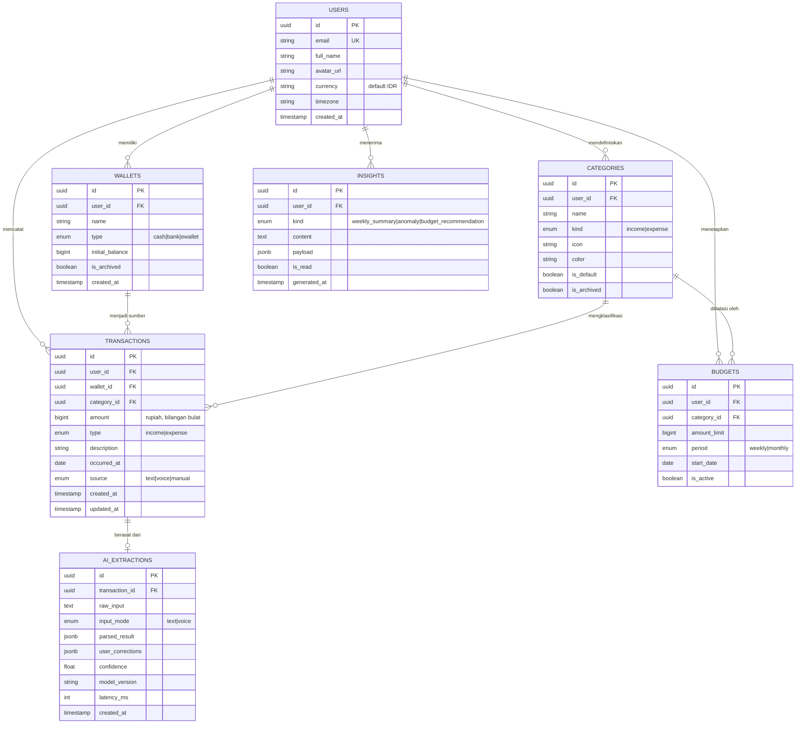

Nama Kelompok: MDG (My Duit Gweh)   
Ketua Kelompok: Garjita Adicandra - 24/535330/TK/59377  
Anggota 1: Muhammad Syauqi Fittuqo - 24/543713/TK/60433  
Anggota 2: Naufal Dzaky - 24/543697/TK/60431  

# Project Senior Project TI
Departemen Teknik Elektro dan Teknologi Informasi  
Fakultas Teknik  
Universitas Gadjah Mada  

---

# Centsible

---

## 🎯 Permasalahan yang Dipecahkan

### Latar Belakang

Survei Nasional Literasi dan Inklusi Keuangan (SNLIK) 2025 yang dilaksanakan OJK bersama BPS terhadap 10.800 responden usia 15–79 tahun di 34 provinsi dan 120 kabupaten/kota mencatat indeks literasi keuangan nasional **66,46%** dan indeks inklusi keuangan **80,51%** [1].

Menariknya, kelompok usia 18–25 tahun — rentang usia mahasiswa — justru mencatat indeks literasi **73,22%** (tertinggi kedua setelah kelompok 26–35 tahun) dan indeks inklusi tertinggi di antara seluruh kelompok usia, yaitu **89,96%** [1][2].

Angka tersebut menyampaikan satu pesan penting untuk perumusan masalah proyek ini: mahasiswa Indonesia bukan kelompok yang *"tidak tahu"* soal keuangan, dan bukan pula kelompok yang *"tidak punya akses"* ke produk keuangan. Mereka tahu, dan mereka punya akses paling luas. Yang bermasalah adalah **eksekusi harian**: kemampuan mengubah pengetahuan menjadi kebiasaan mencatat, mengevaluasi, dan mengendalikan pengeluaran.

Solusi "aplikasi pencatat keuangan" bukan hal baru. Money Lover, Finansialku, Monefy, Spendee, dan puluhan aplikasi sejenis sudah tersedia gratis di Play Store. Persoalannya adalah **retensi**: kategori aplikasi finansial termasuk yang paling cepat ditinggalkan.

Akar penyebabnya dapat dirumuskan sebagai **friction biaya kognitif per transaksi**. Untuk mencatat satu transaksi pada aplikasi konvensional, pengguna harus:

1. Membuka aplikasi
2. Menekan tombol tambah
3. Memilih dompet/rekening
4. Memilih kategori dari daftar panjang
5. Mengetik nominal
6. Mengetik catatan
7. Memilih tanggal
8. Menyimpan

Delapan langkah, sekitar 20–40 detik, dikalikan 5–10 transaksi per hari. Beban ini bertahan beberapa hari, lalu ditinggalkan. Setelah 2–3 hari terlewat, data menjadi tidak akurat, dan ketidakakuratan itu sendiri menjadi alasan untuk berhenti total.

Dengan populasi mahasiswa Indonesia yang mencapai sekitar **10 juta orang** pada 2025 [4], ukuran pasar untuk solusi yang benar-benar menyelesaikan masalah friction ini sangat signifikan.

### Rumusan Permasalahan

> Mahasiswa Indonesia gagal mengendalikan keuangan pribadinya bukan karena tidak memiliki aplikasi pencatat keuangan atau tidak memahami konsep keuangan, melainkan karena biaya kognitif pencatatan manual per transaksi terlalu tinggi untuk dipertahankan sebagai kebiasaan harian, sehingga aplikasi ditinggalkan sebelum data terkumpul cukup untuk menghasilkan wawasan yang berguna.

---

## 💡 Ide Solusi yang Diusulkan Beserta Rancangan Fitur

### Solusi

**Centsible** adalah aplikasi web (PWA) pencatat keuangan pribadi untuk mahasiswa Indonesia yang memindahkan seluruh beban strukturisasi data dari pengguna ke AI agent.

> **Prinsip desain inti:** pengguna hanya bertugas menyampaikan apa yang terjadi; sistem bertugas mengubahnya menjadi data terstruktur.

Setelah data terkumpul, AI agent berganti peran dari pencatat menjadi penasihat: mendeteksi anomali pengeluaran, meringkas pola mingguan dalam bahasa manusia, dan memberi rekomendasi anggaran yang spesifik dan dapat ditindaklanjuti.

> **Prinsip penting:** AI tidak pernah menyimpan transaksi tanpa konfirmasi pengguna. Selalu ada langkah konfirmasi satu ketukan yang menampilkan hasil ekstraksi dan memungkinkan koreksi inline. Ini menjaga akurasi data, membangun kepercayaan pada domain sensitif (uang), dan sekaligus menghasilkan data koreksi untuk evaluasi & perbaikan model.

### Rancangan Fitur Solusi

| Fitur | Keterangan |
|---|---|
| **Teks natural language** | Mengelompokkan data nominal berdasarkan deskripsi panjang |
| **Form manual** | Formulir konvensional (fallback & koreksi) untuk keamanan dan input manual data keuangan |
| **Voice (add-on)** | Tekan mikrofon, ucapkan *"beli bensin gocap"* |

---

## 🔍 Analisis Kompetitor (Minimal 3 Kompetitor)

### Kompetitor 1: Money Lover — Money Manager (Finsify, Vietnam)

| Aspek | Detail |
|---|---|
| **Jenis Kompetitor** | Direct |
| **Jenis Produk** | Aplikasi mobile (Android/iOS) + web, model freemium |
| **Target Customer** | Pengguna umum Asia Tenggara yang ingin melacak pengeluaran pribadi; usia 20–40 tahun |

**Kelebihan**
- Fitur sangat lengkap dan matang: multi-dompet, anggaran, utang-piutang, tagihan berulang, perencana tabungan, multi-mata uang
- Tersedia layanan linked wallet yang menghubungkan rekening bank di beberapa negara termasuk Indonesia
- Basis pengguna besar dan reputasi mapan

**Kekurangan**
- Tidak memahami bahasa alami Indonesia; tidak ada AI agent untuk ekstraksi transaksi dari kalimat bebas
- Banyak fitur inti (dompet tak terbatas, ekspor CSV, lampiran gambar) terkunci di balik premium
- Aplikasi terasa berat dan padat fitur bagi mahasiswa yang hanya ingin mencatat cepat; kurva belajar tinggi

**Key Competitive Advantage & Unique Value**
Kelengkapan fitur pengelolaan keuangan pribadi tingkat lanjut dan kematangan produk lintas platform, ditopang basis pengguna besar di Asia Tenggara serta integrasi rekening di beberapa negara.

---

### Kompetitor 2: Finansialku

| Aspek | Detail |
|---|---|
| **Jenis Kompetitor** | Direct |
| **Jenis Produk** | Aplikasi mobile + platform web, freemium dengan langganan premium |
| **Target Customer** | Masyarakat Indonesia usia produktif yang ingin merencanakan keuangan; cenderung ke segmen pekerja dan keluarga, bukan spesifik mahasiswa |

**Kelebihan**
- Cakupan luas: pencatatan, anggaran, perencanaan keuangan, pengelolaan investasi, hingga laporan keuangan
- Menyediakan konsultasi dengan perencana keuangan bersertifikat pada paket premium
- Mendukung lampiran foto dan lokasi pada setiap transaksi

**Kekurangan**
- Berbayar untuk fitur inti; batasan jumlah transaksi dan rekening pada versi gratis merupakan hambatan besar bagi mahasiswa dengan anggaran terbatas
- Pencatatan tetap manual berbasis form; tidak ada input suara maupun ekstraksi bahasa alami
- Antarmuka relatif padat; time-to-first-value untuk pengguna baru cukup panjang

**Key Competitive Advantage & Unique Value**
Kombinasi aplikasi pencatatan dengan layanan perencanaan keuangan bersertifikat dan konten edukasi berbahasa Indonesia — menjual keahlian manusia, bukan sekadar perangkat lunak.

---

### Kompetitor 3: Monefy — Budget & Expense Tracker (Aimbity AG)

| Aspek | Detail |
|---|---|
| **Jenis Kompetitor** | Direct |
| **Jenis Produk** | Aplikasi mobile (Android/iOS), freemium |
| **Target Customer** | Orang-orang yang ingin mencatat pengeluaran dengan super cepat dan gampang |

**Kelebihan**
- Sangat cepat: paling cepat untuk urusan mencatat, memakai menu bentuk lingkaran sehingga hanya butuh sekitar 4 kali sentuh/klik untuk mencatat pengeluaran
- Ringan & praktis: aplikasinya enteng, loading cepat, dan langsung bisa dimengerti tanpa perlu baca panduan
- Tampilan rapi; versi berbayar (Pro) mendukung pencadangan data ke Google Drive atau Dropbox

**Kekurangan**
- Kurang pintar: tidak ada fitur otomatis sama sekali — tidak bisa mengelompokkan pengeluaran otomatis, tidak ada saran keuangan, dan tidak bisa mendeteksi pengeluaran aneh
- Laporan standar: laporan keuangannya sangat biasa (hanya berupa diagram lingkaran/pie chart)
- Fitur dibatasi: menyambungkan ke lebih dari satu HP atau membuat banyak "dompet" mengharuskan upgrade ke versi Pro

**Key Competitive Advantage & Unique Value**
Kesederhanaan. Andalan utama aplikasi ini adalah "bisa mencatat dengan klik paling sedikit". Mereka fokus membuat proses catat-mencatat jadi sangat praktis, walaupun efeknya fitur aplikasi ini jadi kurang lengkap dibanding yang lain.

---

# LAB 2.4 — MERANCANG SDLC PENGEMBANGAN PRODUK

**Nama Kelompok:** MDG (My Duit Gweh)  
**Nama Proyek:** Centsible  
**Ketua Kelompok:** Garjita Adicandra — 24/535330/TK/59377  
**Anggota 1:** Muhammad Syauqi Fittuqo — 24/543713/TK/60433  
**Anggota 2:** Naufal Dzaky — 24/543697/TK/60431

---

## Metodologi SDLC

### Metodologi yang digunakan

**Agile — Scrumban**

Scrumban adalah gabungan Scrum dan Kanban: jadwal dan pertemuan rutin diambil dari Scrum, sedangkan papan kerja dan batas jumlah tugas diambil dari Kanban.

### Alasan pemilihan metodologi

**1. Waktu luang tim naik-turun dan sulit ditebak — ini alasan utamanya.**
Kami bertiga mahasiswa aktif yang juga punya tugas besar mata kuliah lain, praktikum, dan UTS/UAS. Scrum murni mengharuskan tim berjanji menyelesaikan sejumlah tugas dalam satu sprint, dan janji itu baru masuk akal kalau waktu luang tiap minggu kira-kira sama. Pada tim kami, waktu luang bisa tiba-tiba habis karena deadline mata kuliah lain, sehingga sprint yang gagal bukan karena cara kerjanya salah, tapi karena jadwal kuliah. Akibatnya angka kecepatan tim jadi tidak berguna untuk merencanakan sprint berikutnya. Scrumban membuang janji sprint tadi dan menggantinya dengan alur berkelanjutan: tugas **diambil sendiri** oleh anggota saat dia benar-benar punya waktu, bukan **dibagikan di awal** berdasarkan tebakan.

**2. Bagian AI-nya belum bisa dipastikan dari awal.**
Seberapa akurat AI membaca kalimat seperti *"beli bensin gocap"* baru ketahuan setelah dicoba dan diukur, lalu diperbaiki berulang kali. Karena itu Waterfall tidak cocok — Waterfall mengunci spesifikasi sebelum kami punya bukti. Pekerjaan coba-coba seperti ini juga sulit ditebak lamanya, jadi makin tidak cocok dipaksa masuk sprint dengan target tetap.

**3. Prioritas harus bisa diubah kapan saja.**
Di Scrum, daftar tugas dikunci selama sprint berjalan. Padahal hasil uji coba ke pengguna atau hasil pengukuran akurasi AI bisa mengubah prioritas di tengah jalan, dan menunggu sprint berikutnya berarti membuang waktu yang sudah sempit. Di Scrumban, urutan tugas boleh diatur ulang kapan saja selama tugasnya belum mulai dikerjakan.

---

## Perancangan Tahap 1–3 SDLC

### a. Tujuan dari produk

Membuat pencatatan keuangan harian mahasiswa jadi jauh lebih ringan: dari sekitar 8 langkah (20–40 detik) per transaksi menjadi **satu kalimat + satu kali ketuk untuk konfirmasi**. Dengan begitu kebiasaan mencatat bisa bertahan lama, datanya terkumpul cukup banyak, lalu diolah jadi ringkasan pola pengeluaran dan saran anggaran yang bisa langsung dijalankan.

Target terukur sampai akhir semester:

| Tujuan | Indikator |
|---|---|
| Mencatat jadi cepat | Waktu mencatat satu transaksi ≤ 10 detik (dari mulai mengetik sampai tersimpan) |
| AI-nya akurat | ≥ 85% transaksi tersimpan tanpa perlu dibetulkan manual pada bagian nominal & kategori |
| Penggunanya bertahan | ≥ 60% pengguna uji coba masih mencatat sampai hari ke-14 |
| Datanya berguna | Tiap pengguna aktif dapat ringkasan mingguan & minimal 1 saran anggaran yang jelas |

### b. Pengguna potensial dari produk dan kebutuhan para pengguna tersebut

| Kelompok Pengguna | Karakteristik | Kebutuhan Utama |
|---|---|---|
| **Mahasiswa perantau** (pengguna utama) | Dapat uang saku bulanan/mingguan dari orang tua, 5–10 transaksi kecil per hari (makan, kos, transport, jajan) | Ingin tahu uangnya cukup atau tidak sampai kiriman berikutnya; ingin mencatat tanpa harus berhenti dari kegiatan yang sedang dilakukan |
| **Mahasiswa yang punya penghasilan sendiri** (freelance, part-time, asisten praktikum) | Pemasukan tidak tetap dan waktunya tidak menentu, pengeluaran pribadi bercampur dengan keperluan kerja | Ingin memisahkan pengeluaran per kategori, melihat uang masuk dan keluar tiap periode, dan tahu bulan mana yang boncos |
| **Mahasiswa yang sedang menabung** | Sedang mengumpulkan uang untuk laptop, KKN, atau jalan-jalan | Ingin menetapkan batas pengeluaran per kategori, dapat peringatan kalau boros, dan tahu perkiraan kapan target tabungannya tercapai |

### c. Use case diagram

### d. Functional requirements untuk use case yang telah dirancang

| FR | Deskripsi |
|---|---|
| **FR 1** | Pengguna bisa mendaftar dan masuk memakai email/password atau akun Google, bisa mengatur ulang password yang lupa, serta bisa menghapus akun beserta seluruh datanya. |
| **FR 2** | Pengguna bisa mencatat transaksi dengan mengetik kalimat biasa dalam bahasa Indonesia, termasuk istilah sehari-hari untuk nominal seperti *gocap*, *ceban*, atau *25rb*, lewat satu kolom isian saja. |
| **FR 3** | Sistem membaca kalimat tersebut dan memecahnya menjadi data: nominal, jenis (pemasukan/pengeluaran), kategori, dompet, keterangan, dan tanggal — termasuk kalau pengguna menulis *"kemarin"* atau *"tadi pagi"*. |
| **FR 4** | Sebelum disimpan, sistem menampilkan kartu berisi hasil pembacaan AI dan **wajib** menunggu pengguna menekan tombol simpan. Setiap isian pada kartu itu bisa langsung dibetulkan di tempat. |
| **FR 5** | Setiap kali pengguna membetulkan hasil AI, sistem menyimpan nilai sebelum dan sesudah dibetulkan sebagai bahan untuk mengukur dan memperbaiki akurasi AI. |
| **FR 6** | Pengguna bisa mencatat lewat suara: rekam, lalu suaranya diubah jadi teks, lalu diproses dengan cara yang sama seperti FR 3–FR 4. |
| **FR 7** | Sistem menyediakan form isian biasa yang selalu tersedia dan tetap berfungsi walaupun layanan AI sedang mati. |
| **FR 8** | Pengguna bisa melihat, mengubah, dan menghapus transaksi yang sudah tersimpan, serta menyaringnya berdasarkan tanggal, kategori, dompet, dan jenis transaksi. |
| **FR 9** | Sistem menyediakan kategori bawaan yang sesuai untuk mahasiswa (Makan, Transport, Kos, Kuliah, Hiburan, Kesehatan, Lain-lain), dan pengguna bisa menambah, mengubah, atau menonaktifkan kategori. |
| **FR 10** | Sistem mendukung beberapa dompet sekaligus (tunai, rekening bank, e-wallet). Saldo tiap dompet dihitung otomatis dari transaksinya. |
| **FR 11** | Pengguna bisa menetapkan batas pengeluaran per kategori untuk tiap minggu atau bulan, lengkap dengan indikator seberapa banyak yang sudah terpakai. |
| **FR 12** | Sistem menampilkan halaman ringkasan berisi total saldo, total pemasukan dan pengeluaran periode berjalan, pembagian pengeluaran per kategori, dan grafik tren harian. |
| **FR 13** | Sistem membuat ringkasan pola pengeluaran mingguan dalam bahasa yang mudah dipahami, disertai minimal satu saran anggaran yang jelas dan bisa langsung dijalankan. |
| **FR 14** | Sistem mendeteksi pengeluaran yang tidak wajar (nominal atau frekuensi kategori yang jauh berbeda dari kebiasaan pengguna) lalu memberi peringatan. |
| **FR 15** | Pengguna bisa mengunduh riwayat transaksinya dalam bentuk file CSV untuk rentang tanggal yang dipilih. |
| **FR 16** | Aplikasi berjalan sebagai PWA yang bisa dipasang di layar utama HP. Transaksi tetap bisa dicatat saat tidak ada internet, lalu otomatis tersinkron saat koneksi kembali. |
| **FR 17** | Data tiap pengguna terpisah dan terkunci: seorang pengguna hanya bisa mengakses datanya sendiri. Pembatasan ini diterapkan langsung di tingkat basis data lewat Row Level Security. |

### e. Entity relationship diagram

### f. Low-fidelity wireframe

Wireframe dibuat untuk 4 layar. Tiga layar pertama adalah alur paling penting dalam aplikasi, sedangkan layar keempat adalah tampilan pertama yang dilihat pengguna baru.

| No | Layar | Isi Utama |
|---|---|---|
| 1 | **Dashboard** | Total saldo, ringkasan pemasukan/pengeluaran, pembagian pengeluaran per kategori, daftar transaksi terbaru, dan kolom input transaksi yang menempel di atas menu bawah |
| 2 | **Kartu Konfirmasi AI** | Kalimat asli dari pengguna, hasil baca AI dalam 5 baris (nominal, jenis, kategori, dompet, tanggal) yang tiap barisnya bisa langsung dibetulkan, serta tombol Batal dan Simpan |
| 3 | **Laporan & Anggaran** | Grafik tren pengeluaran harian, indikator pemakaian anggaran per kategori, kartu ringkasan dari AI, dan tombol Ekspor CSV |
| 4 | **Perkenalan Awal** | Logo, tagline, contoh alur "kalimat → data transaksi", tiga poin keunggulan, dan tombol mulai/masuk |

### g. Gantt-Chart pengerjaan proyek dalam kurun waktu 1 semester

| Kegiatan | 1 | 2 | 3 | 4 | 5 | 6 | 7 | 8 | 9 | 10 | 11 | 12 |
|---|:-:|:-:|:-:|:-:|:-:|:-:|:-:|:-:|:-:|:-:|:-:|:-:|
| Brainstorming & riset masalah | █ | █ | | | | | | | | | | |
| Analisis pesaing & validasi ide | | █ | █ | | | | | | | | | |
| Perancangan SDLC (use case, FR, ERD) | | | █ | █ | | | | | | | | |
| Desain UI/UX (Lo-Fi → Hi-Fi) | | | | █ | █ | | | | | | | |
| Setup repo, CI/CD & papan Kanban | | | | █ | | | | | | | | |
| Iterasi 1 — Auth, basis data, CRUD manual | | | | | █ | █ | | | | | | |
| Iterasi 2 — AI baca teks & kartu konfirmasi | | | | | | █ | █ | █ | | | | |
| Iterasi 3 — Dashboard, anggaran, laporan | | | | | | | | █ | █ | | | |
| Iterasi 4 — Input suara & PWA/offline | | | | | | | | | █ | █ | | |
| Iterasi 5 — Ringkasan AI & deteksi anomali | | | | | | | | | | █ | █ | |
| Pengujian (tes otomatis, uji ke pengguna) | | | | | | | █ | | | █ | █ | |
| Rilis & pengukuran akurasi AI | | | | | | | | | | | █ | █ |
| Dokumentasi & presentasi akhir | | | | | | | | | | | █ | █ |

